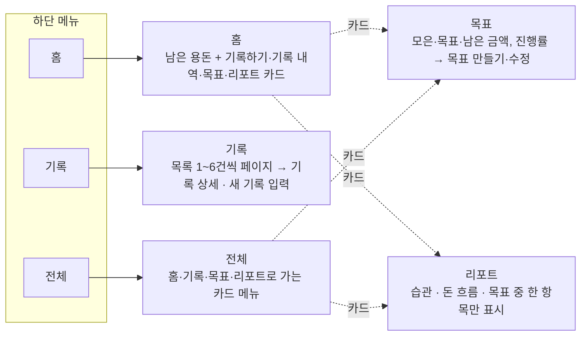

# 포켓WON 기능 명세서

2026-10-03 기준 · 원본: [Claude 문서](https://claude.ai/code/artifact/9b80f182-f79e-4232-be2d-2c9ca6170375)

## 1. 개요

포켓WON은 10~13세 어린이가 받은 돈과 쓴 돈을 기록하고, 저축 목표 하나를 관리하는 모바일 웹앱입니다. 서버 없이 브라우저 안에서만 동작하고, 데이터는 기기의 `localStorage`에 저장됩니다.

| 항목 | 내용 |
| --- | --- |
| 대상 사용자 | 아이(10~13세), 부모·보호자(습관 요약과 대화에 참여) |
| 핵심 기능 | 용돈 기록, 기록 내역, 단일 저축 목표, 습관 리포트 |
| 기술 구성 | 프레임워크 없는 HTML/CSS/JavaScript 정적 앱 |
| 진입점 | `ks6s3juocjzc2.kimi.page/index.html` |
| 저장소 | 브라우저 `localStorage` 키 `pocketwon_demo_v1` (서버·인증·네트워크 저장 없음) |
| 지원 화면 | 세로 320×568 ~ 430×932, 가로 667×375·844×390, 데스크톱(최대 폭 520px 캔버스) |
| 테스트 브라우저 | Chromium, WebKit (Playwright) |

이 명세는 저장소의 `docs/` 보고서(PW-WOORI-01~05, Reference Sync, Single-Screen, Sprite Motion)와 `scripts/state.js`의 현재 코드를 기준으로 작성했습니다. 구현 단계는 Shell → 홈 → 기록 → 목표 → 리포트 순으로 진행했고, 이후 디자인 재구축, 스프라이트 모션, 한 화면(no-scroll) 구조 개편을 거쳤습니다.

### 1.1 제품 방향과 현재 구현 범위

핵심 기능과 현재 구현 완료는 같은 뜻이 아닙니다. 이 명세의 2~5장은 현재 구현된 기능만 다룹니다.

| 기능 | 상태 |
| --- | --- |
| 용돈 기록(받은 돈/쓴 돈), 거래·분류 | 구현됨 |
| 단일 목표 만들기·수정 | 구현됨(적립 제외) |
| 리포트(저장된 점수·돈 흐름·목표 표시) | 구현됨(계산 없이 표시만) |
| 습관 점수 계산, 부모 요약 공유, 칭찬·보상, 다음 계획 | 방향만 확정, 세부 규칙 미정 |
| 습관 캘린더, 연속 기록, 배지·포인트, 주간 알림 | 우선 확장 후보 |
| 금융 퀴즈, 영수증 기록 보조, 부모-자녀 계정 연결, 결제 제한·쿨다운 | 후순위 후보 |
| 실제 계좌·송금·결제, 성인 자산관리 | 범위 밖 |

**제품 정책**

- AI는 감시자가 아니라 코치입니다. 현재는 실제 AI가 있는 것처럼 표현하지 않습니다.
- 부모는 개별 거래를 추궁하기보다 습관 요약과 대화에 참여합니다.
- 읽기 화면은 데이터를 바꾸지 않고, 알 수 없는 상태를 임의의 숫자로 채우지 않습니다.
- 미결정 정책(6장)은 UI나 코드에서 임의로 확정하지 않고, 근거 없는 기능을 만들지 않습니다.

출처: [포켓WON 팀 패들렛](https://padlet.com/gimjeonghugimk/won-s02456nb3dynk10w0nrp) (제품·기획, 진행·결정 카드)

## 2. 화면 구성과 내비게이션

앱은 Header · 본문 · 하단 메뉴로 나뉜 한 화면(100dvh)이고, 본문만 화면별로 바뀝니다. 하단 메뉴는 홈·기록·전체 3개이고, 목표와 리포트는 카드로 엽니다.

홈의 기록하기 카드는 새 기록 입력을 바로 엽니다. 화면을 바꿔도 URL이나 브라우저 방문 기록(history)은 바뀌지 않습니다.

## 3. 화면별 기능 명세

모든 화면은 진입할 때마다 저장된 최신 상태를 다시 읽고, 값이 없거나 잘못되면 0으로 채우지 않고 "확인 안 됨"으로 표시합니다.

### 3.1 홈

| ID | 기능 | 상세 |
| --- | --- | --- |
| HOME-01 | 남은 용돈 표시 | 저장된 `balance`를 "지금 남은 용돈"으로 표시. 큰 금액은 축약하되 정확한 금액을 접근성 레이블과 캡션으로 제공 |
| HOME-02 | 바로가기 카드 | 기록하기 · 기록 내역 · 목표 · 리포트 2×2 카드. 기록하기는 입력 dialog를 바로 엽니다 |
| HOME-03 | 없는 값 만들지 않기 | 주간 예산, 기간, 새 점수처럼 저장 데이터에 없는 값은 표시하지 않음 |

### 3.2 기록

| ID | 기능 | 상세 |
| --- | --- | --- |
| REC-01 | 기록 목록 | 잔액과 함께 거래를 최신순으로 표시. 화면 높이에 맞춰 1~6건씩 보여주고 이전/다음 페이지로 넘김 |
| REC-02 | 날짜 표기 | 오늘 / 어제 / M월 D일(다른 해는 연도 포함). 날짜를 읽을 수 없으면 "날짜 확인 안 됨" |
| REC-03 | 기록 상세 | 정확한 금액, 분류, 날짜, 메모 전문을 텍스트 페이지로 끝까지 표시 |
| REC-04 | 새 기록 입력 | 단계별 dialog: 종류(받은 돈/쓴 돈) → 금액 → 분류(쓴 돈만) → 메모(선택) → 확인 |
| REC-05 | 분류 | 받은 돈: 용돈(고정). 쓴 돈: 간식 · 문구 · 게임 · 교통 · 기타 |
| REC-06 | 저장 결과 | 받은 돈은 balance·monthly.saving 증가, 쓴 돈은 balance 감소·monthly.spending 증가. 새 거래는 목록 맨 앞에 추가 |
| REC-07 | 입력 확인 | 금액은 1원 이상 정수, 메모 50자 이하, 쓴 돈은 잔액 이하, 합계가 안전한 정수 범위 안 |

### 3.3 목표

| ID | 기능 | 상세 |
| --- | --- | --- |
| GOAL-01 | 목표 표시 | 목표 이름, 모은 돈 / 목표 금액 / 남은 금액, 진행률 막대(0~100%, 반올림). 긴 이름은 별도 읽기 화면 |
| GOAL-02 | 목표 만들기 | 이름 → 목표 금액 → 확인. 새 목표는 모은 돈 0원에서 시작 |
| GOAL-03 | 목표 수정 | 이름과 목표 금액만 바꿈. 모은 돈과 기타 속성은 그대로 두고, monthly.goal은 이미 있을 때만 목표 금액과 맞춤 |
| GOAL-04 | 입력 확인 | 이름 1~30자, 목표 금액 1원 이상 정수이면서 지금까지 모은 돈 이상 |
| GOAL-05 | 목표 달성 | 모은 돈 ≥ 목표 금액일 때만 완료. 반올림으로 100%가 되어도 미달이면 완료가 아님. 완료 시 축하 모션을 세션당 한 번 재생 |

### 3.4 리포트

저장된 값만 보여주며, 점수 계산·코칭·AI 호출은 하지 않습니다. 습관 / 돈 흐름 / 목표 중 한 항목씩 선택해 봅니다.

| ID | 항목 | 표시 규칙 |
| --- | --- | --- |
| RPT-01 | 습관 점수 | `habitScore`가 0~100 사이 유한한 숫자일 때만 그대로 표시(소수 반올림 안 함). 그 외는 "확인 안 됨" |
| RPT-02 | 돈 흐름 | 받은 돈(saving), 쓴 돈(spending), 차이(saving − spending, 음수 그대로). "저장된 집계 · 기간 확인 안 됨" 표시. 둘 중 하나라도 없으면 차이를 계산하지 않음 |
| RPT-03 | 기록 수 | 유효한 거래 건수(날짜 불명확 포함). 잘못된 거래가 섞이면 "확인 가능한 기록만 포함했어요" 안내. 빈 배열(0건)과 배열 없음(확인 불가)을 구분 |
| RPT-04 | 목표 | 목표 화면과 같은 규칙. 긴 이름은 별도 페이지 |
| RPT-05 | 다시 불러오기 | 읽기만 다시 시도. 저장 데이터를 고치거나 덮어쓰지 않음 |

### 3.5 전체

홈 · 기록 · 목표 · 리포트 네 화면으로 가는 카드 메뉴입니다. 새 기능은 없습니다.

### 3.6 공통 입력 동작

- 입력은 네이티브 `<dialog>` 한 단계씩 진행하고, Escape·닫기·이전 단계를 지원합니다.
- 입력 중 Enter나 한글 조합(IME)으로 저장되지 않습니다. 마지막 저장 버튼으로만 저장합니다.
- 저장 직전에 최신 상태를 다시 읽고 검사합니다. 실패하면 입력한 내용을 유지한 채 같은 화면에서 다시 시도합니다.
- 저장이 확인된 뒤에만 결과 화면과 성공 모션을 보여줍니다.
- 홈에서 시작한 입력을 취소하면 홈의 기록하기 카드로 포커스가 돌아갑니다.

## 4. 데이터 모델과 저장 규칙

상태는 `localStorage`의 `pocketwon_demo_v1` 키에 JSON 하나로 저장되며, 사용자가 저장 버튼을 눌렀을 때만 씁니다.

### 4.1 상태 구조

| 필드 | 타입 | 의미 | 바꾸는 기능 |
| --- | --- | --- | --- |
| `balance` | 0 이상 정수 | 지금 남은 용돈 | 기록 저장 |
| `monthly.saving` | 0 이상 정수 | 받은 돈 누계(기간 정보 없음) | 받은 돈 기록 |
| `monthly.spending` | 0 이상 정수 | 쓴 돈 누계(기간 정보 없음) | 쓴 돈 기록 |
| `monthly.goal` | 0 이상 정수, 선택 | 목표 금액 사본 | 목표 저장(이미 있을 때만) |
| `transactions[]` | 배열 | 거래 목록, 최신 건이 앞 | 기록 저장 |
| `transactions[].type` | `in` \| `out` | 받은 돈 / 쓴 돈 | — |
| `transactions[].amount` | 1 이상 정수 | 금액(원) | — |
| `transactions[].category` | 문자열 | 분류 | — |
| `transactions[].ts` | ISO 날짜 문자열 | 기록 시각 | — |
| `transactions[].memo` | 문자열, 선택 | 메모(50자 이하, 비어 있으면 생략) | — |
| `transactions[].receipt` | boolean | 영수증 여부(항상 false로 저장) | — |
| `goal.title` | 문자열 | 목표 이름(1~30자) | 목표 저장 |
| `goal.target` | 1 이상 정수 | 목표 금액 | 목표 저장 |
| `goal.current` | 0 이상 정수 | 모은 돈 | 없음(신규 목표는 0) |
| `habitScore` | 0~100 숫자 | 습관 점수 | 없음(읽기만) |

`user`, `missions`, `points`, `streak`, `recordedDays`, `goal.daysLeft` 등 원본 데모에 있던 필드는 읽지도 바꾸지도 않고 그대로 보존합니다.

### 4.2 읽기 상태

| 상태 | 조건 | 처리 |
| --- | --- | --- |
| `loaded` | JSON 객체를 읽음 | 필드별로 검사해 표시 |
| `empty` | 키가 없음 | 처음 사용. 첫 저장 때 0원 상태를 함께 만듦 |
| `invalid` | JSON이 깨졌거나 객체가 아님 | "확인 안 됨" 표시, 자동 복구하지 않음 |
| `unavailable` | localStorage 접근 실패 | "확인 안 됨" 표시, 다시 불러오기 제공 |

### 4.3 저장 원칙

- 화면 진입, 입력, 닫기, 탭 이동, 페이지 이동, 새로고침, 모션 재생에서는 저장하지 않습니다.
- 저장 전 전체 상태가 쓸 수 있는지 확인합니다(잔액·누계 금액이 유효하고 모든 거래가 유효). 아니면 저장을 막습니다.
- 손상된 데이터를 기본값으로 덮어쓰거나 고치지 않습니다.
- 목표 수정은 모은 돈을 바꾸지 않고, 기록 저장도 목표의 모은 돈을 바꾸지 않습니다.
- 기록 목록의 페이지, 리포트 항목 선택, 입력 초안은 세션 메모리에만 둡니다.

## 5. 디자인 시스템과 접근성

디자인 값은 `styles/tokens.css` 한 곳에서 관리하고, 마스코트 그림은 장식일 뿐 금액·버튼 같은 의미는 모두 텍스트 DOM이 담당합니다.

### 5.1 디자인 토큰

| 역할 | 값 |
| --- | --- |
| 배경 / 표면 | `#FAFCFD` / `#FFFFFF` |
| 그림 패널 | `#D9EEFB` / `#C9E8FA` |
| 강조색(진행률 등) | `#0190F8` |
| 파란 글자 / CTA 버튼 | `#0069B7` / `#0077D8` (흰 글자 대비 4.5:1 이상) |
| 본문 글자 | `#343B49`, `#29313F`, `#5C6876` |
| 모서리 | 앱 36 / 카드 30 / 패널 22 / 컨트롤 18px, pill 999px |
| 그림자 | `0 10px 30px rgba(48,67,86,.09)` |
| 글꼴 | Pretendard Variable(로컬 파일, 외부 요청 없음), 숫자는 tabular-nums |
| 레이아웃 | Header 56 / Nav 64px(높이 667px 이하에서 48 / 56px), 여백 12px, 데스크톱 최대 폭 520px |

### 5.2 마스코트와 스프라이트 모션

| 위치 | 액션 동작 |
| --- | --- |
| 홈 잔액 | 지갑을 열어 동전 확인 |
| 기록 | 영수증 펼침 |
| 리포트 | 돋보기를 눈으로 가져옴 |
| 목표 | 깃발 세우기와 작은 점프 |
| 전체 | 옆을 보며 손 흔듦 |
| 저장 성공·목표 달성 | 움츠림 → 만세 → 착지 |

- 대기(idle) 6프레임·6FPS, 액션 8프레임·10FPS(800ms), 성공 10프레임·10FPS(1초). WebP 시트 11개, 각 512KiB 이하.
- 동시에 강한 액션 1개와 대기 모션 1개만 재생합니다. 우선순위는 성공 → 사용자 동작 → 최초 노출 → 대기입니다.
- 화면 밖, 숨겨진 탭, 열린 dialog에서는 멈춥니다. 동작 줄이기(reduced motion) 설정이면 정지 그림만 보여줍니다.
- 성공 모션은 저장이 실제로 확인된 뒤에만 재생합니다.

### 5.3 접근성 요구사항

- 핵심 터치 영역은 48px 이상입니다.
- 그림과 스프라이트는 `aria-hidden`, 빈 alt, `pointer-events: none`입니다.
- dialog는 포커스를 가두고, 닫으면 열었던 버튼으로 포커스를 돌려줍니다. 화면을 바꿀 때는 제목(h1)에 포커스를 둡니다.
- 사용자가 입력한 문자열은 `textContent`로만 넣습니다.
- 일반 화면은 스크롤 없이 한 화면에 맞춥니다. 단, 글자 크기가 20px를 넘거나 화면이 매우 작으면(폭 300px 미만, 높이 320px 미만, 또는 폭 500px 미만이면서 높이 480px 미만) 세로 스크롤 배치로 바뀝니다. 확대를 막거나 글자를 줄이지 않습니다.

### 5.4 사용자 문구 원칙

문구는 짧고 쉽고 평가하지 않는 말로 씁니다.

| 하지 않는 표현 | 이유 |
| --- | --- |
| monthly.saving을 "저축액"이라고 부르기 | 실제로는 받은 돈 누계 |
| "이번 달"이라고 단정하기 | 저장된 집계에 기간 정보가 없음 |
| 저장된 점수를 "AI가 방금 분석한 점수"라고 쓰기 | 점수를 계산하지 않음 |
| 포인트를 현금처럼 표현하기 | 포인트 의미 미정 |
| 목표 완료를 자동 보상 지급으로 연결하기 | 보상 규칙 미정 |
| 우리은행 디자인 참고를 제휴처럼 표현하기 | 제휴 관계 아님 |

부모 화면을 만들 때는 감시보다 습관 요약, 함께 이야기하기, 다음 계획에 초점을 둡니다.

## 6. 범위 밖 기능과 미결 사항

원본 데모에 있던 기능 중 데이터 근거가 없거나 하드코딩된 기능은 제외했습니다.

### 6.1 제외한 기능

| 기능 | 제외 이유 |
| --- | --- |
| 목표 적립(모으기) | 원본에서 잔액·거래와 연결된 안전한 적립 규칙을 찾지 못함. 미션 클릭 시 1,000원 가산은 데모용 수치 |
| 미션·포인트·보상 | 잔액·거래와 연결되지 않은 데모 상태 |
| 습관 점수 계산·AI 코칭 | 원본에 점수 생성 로직이 없고, 코칭은 고정 임계값 기반 |
| 습관 달력·연속 기록(streak) | 2024년 5월 고정 달력. 일(day) 숫자만 있어 실제 날짜를 알 수 없음 |
| 부모 공유 리포트 | 점수 추이가 하드코딩(65, 72, 82, 90) |
| 월별 집계·월 초기화 | monthly에 기간 정보가 없음 |
| 다크 모드·인트로 | 이번 재구축 범위에서 제외(Light 디자인만) |
| 기록 수정·삭제 | 구현되지 않음 |

### 6.2 미검증 항목

- 실제 휴대폰의 키보드와 스크린리더로는 검증하지 않았습니다(키보드는 가상 VisualViewport 260px로만 확인).
- 한 화면 구조 개편 이후 공개 배포는 하지 않았습니다. 공개 사이트는 2026-09-11 배포본입니다.

### 6.3 공식 미결정 사항

아래 기능은 선행 결정이 나기 전까지 화면부터 만들지 않습니다.

| 기능 | 선행 결정 |
| --- | --- |
| 목표 적립 | OD-003 |
| AI·점수, 캘린더·연속 기록 | OD-004, OD-005 |
| 부모 공유 | OD-006 ~ OD-008 |
| 보상·포인트·다음 계획 | OD-006, OD-009 |
| 알림 | OD-010 |
| 영수증 | OD-011 |
| 실제 금융 | OD-012 |
| 실제 서비스 환경 | OD-014 |
| 운영·관리자 | OD-016 |
| 동시 저장·정정 | OD-020 |

그 밖에 가입·로그인, 부모-자녀 연결·해제, 보호자 동의, 연령 확인, 데이터 보관·삭제, 가격·수익모델도 정해지지 않았습니다. 아동·금융 서비스이므로 현재의 로컬 데모 안전장치를 실제 서비스 보안으로 보지 않습니다.

### 6.4 1차 문답 (답변 대기)

패들렛 ‘04. 진행·결정’에 올라온 6개 질문입니다. 답이 정해지면 해당 기능 명세를 고칩니다.

| # | 질문 | A | B | C | 영향받는 명세 |
| --- | --- | --- | --- | --- | --- |
| 1 | 목표에 모은 돈과 쓸 수 있는 용돈의 관계 | 같은 돈 안에서 목표용으로 따로 배정 | 목표 진행만 별도 기록(잔액 그대로) | 실제 저금통에 옮긴 돈을 구분 | GOAL-01~05, 4.1 |
| 2 | 지난 날짜의 기록 추가 | 오늘만 | 과거 날짜 자유(미래 불가) | 최근 30일 이내 | REC-04, REC-02 |
| 3 | 습관 점수와 피드백 | 규칙 점수 + 준비된 문장 | 규칙 점수 + AI 설명 | AI가 점수와 설명 모두 | RPT-01 |
| 4 | 부모가 리포트를 보는 방식 | 아이 기기에서 함께 보기 | 아이가 요약본을 골라 공유 | 부모가 자기 기기에서 로그인 | 3.4 리포트 |
| 5 | 약속한 보상을 받았는지 확인 | 아이가 확인 | 부모가 확인 | 아이 요청 → 부모 최종 확인 | 신규 |
| 6 | 잘못 입력한 거래 고치기 | 수정·삭제 후 재계산 | 수정·삭제 + 변경 이력 보존 | 원본 유지 + 취소·정정 기록 추가 | REC-01~07, 4.1 |

### 6.5 패들렛과 저장소의 차이

패들렛 일부 카드는 PW-WOORI-04 무렵 상태를 적고 있어, 현재 저장소 코드와 다릅니다. 이 명세는 저장소를 기준으로 작성했습니다.

| 항목 | 패들렛 | 현재 저장소 |
| --- | --- | --- |
| 최신 소스·테스트 | 미회수(가장 큰 차단 요소) | GitHub `pocketWON/pocketWON` main에 있음 |
| 하단 탭 | 홈 / 기록 / 목표 / 리포트 / 전체 5개 | 홈 / 기록 / 전체 3개(목표·리포트는 카드로 열기) |
| 본문 스크롤 | 독립 스크롤 본문 | 스크롤 없는 한 화면(접근성 재배치 때만 스크롤) |
| 최대 폭 | 430px | 520px |
| 리포트·전체 | placeholder | 구현됨(PW-WOORI-05, 검증 329개 PASS) |
| 디자인 토큰 | 배경 #F5F8FC, 블루 #0075C8, 카드 모서리 20 | 배경 #FAFCFD, CTA #0077D8, 카드 모서리 30 (5.1) |
| 캐릭터 | 다시 쓸지 미결정 | 마스코트·스프라이트 모션 적용됨 |

캐릭터 사용은 패들렛의 ‘디자인 미결정’ 항목과 충돌하므로, 팀에서 공식 결정으로 확정하거나 되돌릴지 정해야 합니다.

## 7. 구현 상세와 완료 기준

이 장은 코드 없이 이 문서만으로 같은 동작을 만들 수 있도록, 현재 코드의 실제 문구·형식·검증 기준을 옮겨 적은 것입니다.

### 7.1 상태별 화면

읽기 상태(4.2)에 따라 각 화면은 아래처럼 보입니다. 셀의 따옴표 문구는 실제 화면 문구입니다.

| 화면 | 정상(`loaded`) | 처음 사용(`empty`) | 손상·접근 실패(`invalid`·`unavailable`) |
| --- | --- | --- | --- |
| 홈 | 잔액 + "지금 쓸 수 있는 돈이에요." (balance가 잘못되면 "확인 안 됨" + "저장된 잔액을 확인할 수 없어요.") | "확인 안 됨" + "첫 기록을 남기면 여기에 보여드려요." | "확인 안 됨" + "저장된 정보를 불러오지 못했어요." + Header에 "다시" 버튼(잔액 다시 불러오기) |
| 기록 | 잔액 + 목록. 거래가 0건이면 "아직 기록이 없어요." / 일부 거래가 잘못되면 "일부 기록 정보를 확인할 수 없어요." + 그 항목은 "확인할 수 없는 기록" | "아직 기록이 없어요." + "돈을 받거나 썼을 때 남겨보세요." | "저장된 용돈 정보를 불러오지 못했어요." + "새 기록 추가" 대신 "다시 불러오기" |
| 목표 | 이름, 모은 돈, 진행률, 목표·남은 금액 + "목표 수정" / "기록하러 가기". goal이 없으면 처음 사용과 같음 | "아직 정한 목표가 없어요." + "갖고 싶은 것을 하나 정해볼까요?" + "첫 목표 만들기" | "목표 정보를 확인할 수 없어요." + "기존 정보는 그대로 보관하고 있어요. 다시 불러와 확인해주세요." + "다시 불러오기". goal 값이 잘못돼도 같음 |
| 리포트 | 습관/돈 흐름/목표 항목 + "기록 보기" 또는 "목표 보기". 값별로 "확인 안 됨" | "아직 보여줄 기록이 없어요." + "용돈을 기록하면 여기에서 확인할 수 있어요." + "첫 기록 남기기" | "저장된 정보를 확인할 수 없어요."(손상) / "저장된 정보를 불러오지 못했어요."(접근 실패) + "다시 불러와 저장된 상태를 확인해 주세요." + "다시 불러오기" |
| 전체 | 카드 4개(상태와 무관) | 같음 | 같음 |

입력 dialog의 저장 단계 상태는 다음과 같습니다.

| 단계 | 기록 입력 | 목표 입력 |
| --- | --- | --- |
| 저장 중 | 저장 버튼 비활성. 두 번 누르거나 더블클릭해도 1회만 저장 | 같음 |
| 저장 전 재검사 실패 | 오류 문구를 확인 단계에 표시, 입력 유지 | 같음. 열었을 때와 목표가 달라졌으면 충돌 문구 |
| 쓰기 실패 | "기록을 저장하지 못했어요. 다시 시도해주세요." | "목표를 저장하지 못했어요. 다시 시도해주세요." |
| 저장 성공 | dialog를 닫고 결과 화면 + 성공 모션 | 같음 |

### 7.2 화면 문구

아래 문구는 코드에 있는 그대로입니다. 새로 만들 때도 같은 문구를 씁니다.

**입력 오류 문구**

| 조건 | 문구 |
| --- | --- |
| 기록: 종류 미선택 | 받은 돈인지 쓴 돈인지 골라주세요. |
| 기록: 분류 미선택 | 어떤 돈이었는지 골라주세요. |
| 기록: 금액이 1 미만이거나 정수가 아님 | 1원 이상의 정수로 입력해주세요. |
| 기록: 쓴 돈 > 잔액 | 지금 가진 돈보다 큰 금액이에요. |
| 기록: 합계가 안전한 정수 범위(2^53−1)를 넘음 | 저장할 수 있는 금액 범위를 넘었어요. |
| 기록: 메모 50자 초과 | 메모는 50자까지 적을 수 있어요. |
| 기록: 저장된 상태를 쓸 수 없음 | 저장된 용돈 정보를 확인할 수 없어 기록을 저장할 수 없어요. |
| 기록: 저장 직전 읽기 실패 | 저장된 용돈 정보를 불러오지 못했어요. 다시 시도해주세요. |
| 목표: 이름 없음(공백만 포함) | 목표 이름을 적어주세요. |
| 목표: 이름 30자 초과 | 목표 이름은 30자까지 적을 수 있어요. |
| 목표: 금액이 숫자만이 아니거나 0 | 1원 이상의 정수로 입력해주세요. |
| 목표: 목표 금액 < 모은 돈 | 지금까지 모은 금액 이상으로 정해주세요. |
| 목표: 저장된 목표·용돈을 쓸 수 없음 | 저장된 목표나 용돈 정보를 확인할 수 없어 저장할 수 없어요. |
| 목표: 저장 직전 읽기 실패 | 저장된 정보를 불러오지 못했어요. 다시 시도해주세요. |
| 목표: 열었을 때와 목표가 달라짐(충돌) | 목표 정보가 바뀌었어요. 닫은 뒤 다시 열어 확인해주세요. |

오류가 여러 개면 확인 단계에는 form → amount → category → memo → type 순서로 첫 번째 하나만 보여줍니다. 입력 전 빈 칸에는 오류를 보여주지 않고 "다음" 버튼만 비활성화합니다.

**기록 입력 dialog** (제목: 돈 기록하기)

| 단계 | 질문 | 도움말 / 예시 | 버튼 |
| --- | --- | --- | --- |
| 종류 | 어떤 돈인가요? | 선택지: 받은 돈 / 쓴 돈 | 다음 |
| 금액 | 얼마인가요? | 원 단위로 숫자만 입력해주세요. / 숫자로 입력 | 다음 |
| 분류(쓴 돈만) | 어디에 썼나요? | 간식 · 문구 · 게임 · 교통 · 기타 | 다음 |
| 메모 | 메모를 남길까요? | 50자까지 적을 수 있어요. 건너뛰어도 괜찮아요. / 예: 학교 끝나고 간식 | 건너뛰기(빈 칸일 때) 또는 다음 |
| 확인 | 이대로 기록할까요? | 종류 / 금액 / 분류 / 메모(없으면 "없음") | 기록 저장 |
| 결과 | 기록했어요. | 받은 돈을 남겼어요. / 쓴 돈을 남겼어요. + 금액 | 기록 내역 보기 |

**목표 입력 dialog** (제목: 목표 만들기 / 목표 수정)

| 단계 | 질문 | 도움말 / 예시 | 버튼 |
| --- | --- | --- | --- |
| 이름 | 무엇을 모으고 있나요? | 30자까지 적을 수 있어요. / 예: 새 자전거 | 다음 |
| 목표 금액 | 얼마가 필요하나요? | 수정: 지금까지 모은 {N}원 이상으로, 숫자만 입력해주세요. / 새 목표: 원 단위로 숫자만 입력해주세요. | 다음 |
| 확인 | 이 목표로 저장할까요? | 목표 이름 / 목표 금액 + "지금까지 모은 {N}원은 유지돼요." | 목표 저장 |
| 결과 | 목표를 만들었어요. / 목표를 바꿨어요. | 목표 이름 + 목표 금액 | 목표 보기 |

모든 dialog에는 "‹"(이전 단계)와 "×"({제목} 닫기) 버튼이 있습니다.

**화면 고정 문구**

| 위치 | 문구 |
| --- | --- |
| 홈 카드 | 기록하기 · 받거나 쓴 돈 남기기 / 기록 내역 · 내 돈이 오간 순간 / 목표 · 모으고 싶은 것 / 리포트 · 저장된 돈 습관 |
| 전체 카드 | 홈 · 내 용돈과 주요 행동 / 기록 · 받은 돈과 쓴 돈 / 목표 · 모으고 싶은 목표 / 리포트 · 저장된 돈 습관 |
| 기록 화면 | 지금 쓸 수 있는 돈 / 기록 내역 / 새 기록 추가 / 이전 · {현재} / {전체} · 다음 |
| 기록 상세 | 기록 상세 / 목록으로 / 분류: … 날짜: … 메모: …(없으면 "메모 없음") |
| 목표 화면 | 지금까지 모은 돈 / {P}% 진행 또는 목표 달성 · {P}% / 목표 금액 / 남은 금액 / "저장된 목표 금액을 기준으로 보여드려요." 또는 "목표를 달성했어요!" / 목표 수정 / 기록하러 가기 / 목표로 돌아가기 |
| 리포트 | 용돈 습관 리포트 / 항목: 습관 · 돈 흐름 · 목표 / 저장된 습관 점수 + "저장된 값 그대로 보여드려요." 또는 "저장된 습관 점수가 없어요." / 저장된 돈 흐름 · 저장된 집계 · 기간 확인 안 됨 / 받은 돈 · 쓴 돈 · 차이 / 차이 = 받은 돈 − 쓴 돈 / 저장된 기록 {N}건 / 나의 목표 / 목표까지 {N}원 또는 목표 달성 |
| 브라우저 탭 제목 | {화면 이름} · 포켓WON |

### 7.3 세부 형식

**시각**

- 저장: `new Date().toISOString()`, 즉 UTC ISO 문자열입니다(예: `2026-10-03T09:35:08.376Z`).
- 읽기: `YYYY-MM-DDTHH:mm:ss` 뒤에 밀리초(1~3자리)와 시간대(`Z` 또는 `±HH:MM`)가 선택으로 붙는 형식만 받습니다. 2월 30일처럼 없는 날짜나 24시 이상은 "날짜 확인 안 됨"입니다.
- 표시: 기기의 현지 시간 기준입니다. 오늘 / 어제 / `M월 D일` / 다른 해는 `YYYY년 M월 D일`.

**금액**

- 숫자는 `Intl.NumberFormat('ko-KR')`로 세 자리마다 쉼표를 넣고 "원"을 붙입니다(예: 12,300원).
- 큰 금액 카드(홈·기록 잔액, 목표, 리포트): 1억 이상이면 억원, 1조 이상이면 조원, 1경 이상이면 경원으로 나눠 소수점 한 자리까지 표시합니다(예: 1.2억원). 정확한 금액은 아래 캡션과 접근성 레이블(`aria-label`)로 함께 제공합니다.
- 기록 목록: 받은 돈 `+`, 쓴 돈 `−`(U+2212)를 붙입니다. 문자열이 14자를 넘으면 억/조 단위로 줄여 씁니다.
- 리포트의 차이는 음수도 그대로 표시합니다.
- 진행률은 `round(current / target × 100)`을 0~100으로 자릅니다.

**문자열**

- 메모와 목표 이름은 앞뒤 공백을 지우고 글자 수를 셉니다. 이모지도 한 글자입니다(`Array.from(text).length`).
- 빈 메모는 저장하지 않습니다(`memo` 필드 생략).
- 금액 입력은 숫자만 받습니다(목표 금액은 `/^[0-9]+$/`).
- 목록 항목의 제목은 메모, 메모가 없으면 분류입니다. 두 번째 줄은 `분류 · 날짜`(제목이 분류이면 날짜만)입니다.

**기록 목록 페이지**

- 한 페이지 건수 = `floor((목록 높이 + 8) / 72)`를 1~6으로 자른 값입니다(항목 높이 64px + 간격 8px).
- 정렬: 모든 거래가 유효하고 날짜를 읽을 수 있으면 날짜 내림차순, 하나라도 아니면 저장된 순서(새 거래가 앞) 그대로입니다.
- 화면 크기가 바뀌면 포커스된 항목(없으면 현재 페이지 첫 항목)이 들어간 페이지로 이동합니다.
- 현재 페이지와 리포트 항목 선택은 세션 메모리에만 기억하고, 새로고침하면 홈에서 1페이지·습관 항목으로 다시 시작합니다.

**긴 텍스트**

기록 상세, 긴 목표 이름, 입력 확인 내용은 상자 크기에 맞는 만큼 글자를 잘라 페이지로 나눕니다. "이전 · N / M · 다음"으로 넘기고, 한 페이지면 버튼을 숨깁니다.

**처음 저장**

저장 키가 없는 상태에서 첫 저장을 하면 `{ balance: 0, monthly: { saving: 0, spending: 0 }, transactions: [] }`를 만든 뒤 거래나 목표(`goal.current = 0`)를 적용합니다. 따라서 처음 사용자는 받은 돈부터 기록해야 하며, 첫 기록이 쓴 돈이면 잔액 부족으로 실패합니다.

### 7.4 완료 기준

아래 시나리오가 모두 통과하면 현재 기능과 같게 동작하는 것으로 봅니다. 기본 상태 S는 `balance 32,500 / saving 15,200 / spending 12,300 / 거래 4건 / goal { title: "게임 아이템", target: 45,000, current: 30,600 } / habitScore 82`입니다.

| 기능 | 시작 상태 | 동작 | 기대 결과 |
| --- | --- | --- | --- |
| REC-06 | S | 쓴 돈 3,500원 · 간식 저장 | balance 29,000, spending 15,800, saving·goal 그대로, 거래 5건(새 거래가 맨 앞), "기록했어요." 화면 |
| REC-06 | S | 받은 돈 10,000원 저장 | balance 42,500, saving 25,200, category "용돈" |
| REC-07 | S | 쓴 돈 32,501원 | "지금 가진 돈보다 큰 금액이에요.", 저장 없음 |
| REC-07 | S | 금액 0, -5, 1.5, 빈 칸 | "다음" 비활성 또는 "1원 이상의 정수로 입력해주세요.", 저장 없음 |
| REC-07 | S | 메모 51자 | "메모는 50자까지 적을 수 있어요." |
| REC-04 | S | 받은 돈 선택 | 분류 단계 없이 금액 → 메모 → 확인 |
| REC-04 | S | 금액 입력 중 Enter, 한글 조합 중 Enter | 저장되지 않음 |
| REC-04 | S | 기록 저장을 빠르게 두 번 클릭 | 거래 1건만 추가 |
| REC-04 | S, 쓰기 실패 | 기록 저장 | "기록을 저장하지 못했어요. 다시 시도해주세요.", 입력 유지, 저장 문자열 변화 없음 |
| REC-04 | 빈 키 | 쓴 돈 1,000원 | 잔액 부족 오류 |
| REC-04 | 빈 키 | 받은 돈 5,000원 | `{ balance: 5000, monthly: { saving: 5000, spending: 0 }, transactions: [1건] }` 생성 |
| REC-01 | 거래 20건 | 기록 화면 열기 | 화면 높이에 맞는 1~6건 + "1 / N", 문서 스크롤 없음 |
| REC-02 | 날짜가 "2026-02-30T10:00:00"인 거래 | 기록 화면 | "날짜 확인 안 됨", 저장 순서 유지 |
| GOAL-02 | goal 없음 | "새 자전거" 200,000원 저장 | goal { title, target: 200000, current: 0 }, monthly.goal 추가 안 됨 |
| GOAL-03 | S | 이름 "축구화", 목표 50,000원으로 수정 | title·target만 변경, current 30,600 유지, daysLeft 등 다른 필드 유지 |
| GOAL-04 | S | 목표 금액 30,000원 | "지금까지 모은 금액 이상으로 정해주세요." |
| GOAL-04 | S | 이름 31자 | "목표 이름은 30자까지 적을 수 있어요." |
| GOAL-04 | S, dialog를 연 뒤 다른 탭에서 목표 변경 | 목표 저장 | 충돌 문구, 저장 없음 |
| GOAL-05 | current 44,999 / target 45,000 | 목표 화면 | "100% 진행", 미달성(완료 문구·축하 없음) |
| GOAL-05 | current 45,000 / target 45,000 | 목표 화면 | "목표 달성 · 100%", "목표를 달성했어요!", 축하 모션은 세션당 1회 |
| RPT-01 | habitScore 82.5 / -1 / "82" / 없음 | 리포트 습관 | 82.5 그대로 / 나머지는 "확인 안 됨" |
| RPT-02 | saving 1,000 / spending 3,000 | 리포트 돈 흐름 | 차이 -2,000원 |
| RPT-02 | spending 없음 | 리포트 돈 흐름 | 쓴 돈·차이 "확인 안 됨"(0으로 채우지 않음) |
| RPT-03 | 유효 3건 + 잘못된 1건 | 리포트 돈 흐름 | "저장된 기록 3건" + "확인 가능한 기록만 포함했어요." |
| 공통 | 키가 깨진 JSON `{bad` | 모든 화면 방문 후 다시 불러오기 | 저장 문자열이 바뀌지 않음, 각 화면 손상 상태 문구 |
| 공통 | S | 모든 화면 방문, 탭 이동, 새로고침, dialog 열고 닫기 | localStorage 쓰기 0회 |
| 공통 | S | 화면 320×568 ~ 430×932, 667×375 | 문서·본문 가로·세로 스크롤 없음, 터치 영역 48px 이상 |
| 공통 | S, 글자 200% 확대 | 모든 화면 | 세로 스크롤로 모든 버튼에 접근 가능, 글자 잘림 없음 |

현재 저장소에서는 같은 기준을 `tests/verify-business-contracts.cjs`, `verify-single-screen.cjs`, `verify-record-stage.cjs`, `verify-record-keyboard.cjs`, `verify-sprite-stage.cjs`가 Chromium·WebKit에서 검사합니다.
