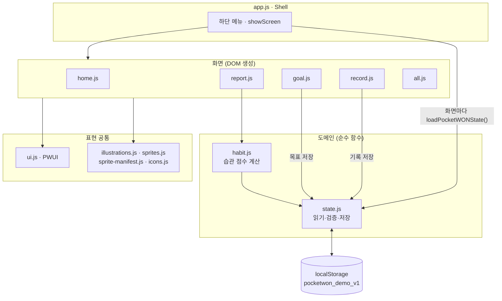
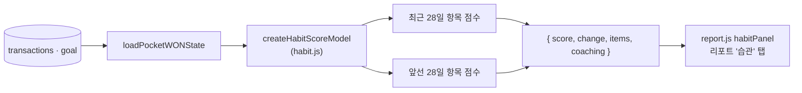

# 포켓WON 아키텍처 요약

2026-10-03 기준. 앱 진입점은 `ks6s3juocjzc2.kimi.page/index.html`입니다.

## 1. 전체 구조

프레임워크·빌드 단계 없는 정적 앱입니다. `index.html`이 `<script defer>`로 전역 함수 파일을 순서대로 불러오고, 서버·네트워크 없이 브라우저 `localStorage`(`pocketwon_demo_v1`)만 씁니다.

## 2. 계층별 역할

| 계층 | 파일 | 역할 |
| --- | --- | --- |
| Shell | `app.js`, `tabs.js` | 화면 전환(`showScreen`), 하단 메뉴, 제목·포커스, 접근성 재배치 판정. 화면을 바꿀 때마다 저장소를 새로 읽어 화면에 넘깁니다. URL·history는 바꾸지 않습니다. |
| 화면 | `home.js`, `record.js`, `goal.js`, `report.js`, `all.js` | `create*View(loaded, navigate, options)`가 `{ element, mount, dispose }`를 돌려줍니다. 입력 단계·페이지·선택 항목은 화면 안 메모리에만 둡니다. |
| 도메인 | `state.js` | 상태 읽기(`loaded`/`empty`/`invalid`/`unavailable`), 거래·목표 검증, `apply*`로 다음 상태 생성, `persistPocketWONState`로 저장. 화면용 view model(`create*ViewModel`)도 여기서 만듭니다. |
| 도메인 | `habit.js` | `createHabitScoreModel(state, now)`: 거래 기록으로 습관 점수를 계산하는 순수 함수. 읽기 전용입니다. |
| 표현 공통 | `ui.js` | `PWUI.el/button/money/createTextPager/flow`(dialog) 등 DOM 도우미. |
| 장식 | `illustrations.js`, `sprites.js`, `sprite-manifest.js`, `icons.js` | 마스코트·스프라이트 모션·아이콘. 모두 `aria-hidden`이고 금융 의미는 텍스트 DOM이 담당합니다. |
| 스타일 | `styles/tokens.css` + 화면별 CSS | 디자인 토큰 한 곳에서 관리, 화면별 레이아웃은 각 CSS. |

## 3. 데이터 흐름

**읽기** — 메뉴·카드를 누르면 `showScreen` → `loadPocketWONState()` → 화면 생성. 읽기는 데이터를 고치거나 쓰지 않습니다.

**쓰기** — 기록·목표 dialog의 마지막 저장 버튼에서만 일어납니다.

1. 저장 직전에 `loadPocketWONState()`로 최신 상태를 다시 읽음
2. `validateRecordDraft` / `validateGoalDraft`로 검사
3. `applyTransaction` / `applyGoalUpdate`로 새 상태 생성(원본 불변)
4. `persistPocketWONState`로 저장, 실패하면 입력 유지
5. 저장이 확인된 뒤에만 결과 화면·성공 모션

## 4. 습관 점수 (분석 + 표시)

- **분석**: 최근 28일(현지 날짜) 거래로 기록 빈도 30 + 소비 패턴 25 + 목표 행동 25 + 저축 습관 20 = 100점. 규칙은 [기능 명세서 3.4.1](../POCKETWON_FEATURE_SPEC.md)에 있습니다.
- **변화**: 같은 규칙으로 바로 앞 28일을 계산해 차이를 냅니다.
- **확인 불가 처리**: 잘못된 거래·미래 시각은 제외하고 `partial` 표시, 목표가 잘못되면 그 항목과 총점은 `null`("확인 안 됨").
- **코칭**: 만점 대비 비율이 가장 높은/낮은 항목에 준비된 문장을 붙입니다. AI 호출은 없습니다.
- **저장하지 않음**: 화면을 열 때마다 계산만 하므로 기록을 저장하면 다음 리포트 진입 때 바로 반영됩니다. 원본 데모의 `habitScore` 필드는 보존만 하고 쓰지 않습니다.
- **분리 이유**: 기존 계약 테스트가 `createReportViewModel` 출력 전체를 비교하므로, 점수 로직은 별도 파일(`habit.js`)에 두고 리포트 화면만 이를 사용합니다.

## 5. 테스트

| 파일 | 대상 | 실행 환경 |
| --- | --- | --- |
| `tests/verify-business-contracts.cjs` | 금융 함수·view model 계약 | Node.js |
| `tests/verify-habit-score.cjs` | 습관 점수 규칙 | Node.js |
| `tests/verify-single-screen.cjs` 외 | 화면 배치·입력·스프라이트 | Playwright (Chromium·WebKit) + 로컬 서버 |

## 6. 운영 메모

- 로컬 서버(`python3 -m http.server`)는 `Cache-Control`을 보내지 않아 브라우저가 예전 JS를 캐시할 수 있습니다. 바뀐 파일은 `index.html`에서 `?v=` 쿼리로 버전을 올립니다.
- `deployments/PW-WOORI-05/site/out/`은 배포 미러이며 `scripts/sync-sprite-mirror.py`로 동기화합니다. 습관 점수 변경은 아직 미러에 반영하지 않았습니다.
