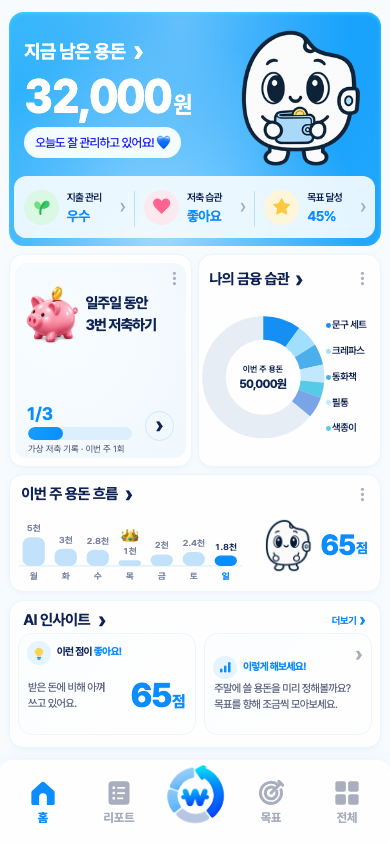

# 포켓WON 홈 구매 도넛·캐릭터·점수 개선

2026-10-04. 최신 사용자 수정 요청까지 반영한 홈이다. 기존 fullscreen 구성과 84px 하단바를 유지한다.

## 최종 화면

- Hero 캐릭터의 목표 셀 크기는 222 → 250 디자인 px(+12.6%)다. 모든 balance action/idle 프레임의 실제 alpha 합집합 `[105,100,297,319]`을 사용해 텍스트·카드·상태 패널에서 8 CSS px를 확보한다. 좁은 화면이나 긴 금액에서는 가용 공간에 맞춰 제한한다.
- 홈의 가상 데이터 배지와 공간은 제거했다. 전체 메뉴의 실제 기록 전환과 데모 저장 차단은 유지한다.
- 섹션 제목은 ‘AI 인사이트’다. 긍정 인사이트는 ‘이런 점이 좋아요!’와 첨부한 디자인을 따른 큰 파란 숫자·작은 ‘점’으로 구성한다. 원형 테두리와 작은 습관 점수 라벨은 제거했다. 최근 28일 점수와 강점 문구를 리포트와 같은 모델·시각으로 계산한다. 계산 불가 시 —점과 기록 안내를 보여준다.
- 도넛은 크게, 목록은 도넛 바로 옆에 배치했다. 목록의 시작 위치를 122 디자인 px로 고정해 짧은 화면에서도 도넛과의 간격이 벌어지지 않게 했다. 품목명과 색상 점 간격은 1px다. 초기 구매 도넛 79 디자인 px에서 최종 130px로 약 65% 확대했다. 최신 요청에 따라 가격을 숨기고 금액이 큰 대표 품목 이름 5개만 표시한다. 가격은 상세 내역에서 확인한다. ‘외 N건’ 행과 하단 안내 문구는 최신 요청에 따라 제거했다. 나의 금융 습관 제목·화살표는 기존 전체 기록 목록으로 연결하며 각 품목은 원본 거래 상세를 연다. 기록 목록에서 페이지를 넘겨 모든 구매를 볼 수 있다.
- 도넛의 계산에는 5건 밖의 구매도 포함된다. 나머지는 여섯 번째 블루 구간으로 합산하되 홈 목록에는 추가 행을 만들지 않는다. 돈을 쓰지 않은 부분은 연한 회청색이다.
- 단색 팔레트는 `#168FF5`, `#A0DFFE`, `#4AAFEA`, `#C1E8FF`, `#55CBE8`, `#79A4E8`이다. 진한 남색을 빼고 인접 구간 명도 차이를 확보했다. 목록 색상 점은 동일한 구간색을 쓴다. 초과 지출은 분홍 경고 링과 초과 금액으로 구별한다.
- 주간 지출 막대에서 유효한 기록이 있는 날 중 가장 적게 쓴 날 하나에 왕관을 표시한다. 수입만 있는 날은 0원, 동률은 가장 최근 날짜다. 미래·미확인·미기록 날짜는 후보가 아니다. 현재 요일의 파란 강조는 유지한다. 주간 카드 오른쪽의 말풍선과 음표는 제거하고, 기존 캐릭터를 왼쪽으로 옮겨 오른쪽의 큰 파란 점수와 나란히 배치했다. 점수는 AI 인사이트와 같은 최근 28일 모델이며 화면에는 숫자와 ‘점’만 표시한다. 계산할 수 없으면 —점이다.

## 집계와 저장

`createPurchaseDonutModel(loaded, now, period)`는 읽기 전용이다. 기본 기간은 현지 월요일~일요일이며, 선택적 `{start:'YYYY-MM-DD', end:'YYYY-MM-DD'}` 범위를 받는다. 종료일도 포함하고 미래 시각은 제외한다. 부모 지급 기간 설정 화면은 추가하지 않았다.

유효한 수입 합계를 분모로 각각의 지출 거래를 나눈다. 50,000원 중 5,000원 구매의 SVG arc는 원의 정확히 10%이며 시각적인 틈을 빼서 줄이지 않는다. 메모 없는 구매는 ‘이름 없는 구매’로 표시한다. 동일 이름도 별개 거래이고, 가격 내림차순·동액 최신순이다. 수입 없음·읽기 실패·잘못된 기간·정수 합계 초과는 비율을 만들지 않는다. 초과 지출도 실제 구매 가격을 유지한다.

데모는 50,000원 수입, 18,000원 구매, 32,000원 잔액이다. 문구 세트 5,000원, 크레파스 3,000원, 동화책 2,800원, 버스 카드 충전 1,000원, 색종이 2,000원, 필통 2,400원, 스티커 1,800원의 7일 기록을 사용한다. 최근 완료된 예시 주간 기준이며 리포트와 홈 모두 이 시각으로 65점을 계산한다. 실제 AI·계좌 연결을 추가하지 않았다.

## 변경 파일과 보존 범위

- `scripts/home.js`: 주간 구매 모델, 도넛·목록, 왕관, 파란 점수 표기.
- `scripts/demo.js`: 일관된 수입·지출·구매 이름과 계산된 점수 연결.
- `scripts/report.js`: 홈과 같은 안전한 습관 점수와 데모 기준 시각 사용. 기존 공개 순수 금융 API는 유지.
- `scripts/viewport.js`: 실제 그림 외곽으로 Hero 캐릭터 배치·확대 제한.
- `styles/home.css`, `styles/viewport.css`: 큰 도넛과 오른쪽 5개 목록, 파란 점수 표기, 왕관 여백, 화면 행 비율.
- `index.html`: 변경 CSS·JS의 내용 해시로 캐시 갱신.
- 테스트·README·이 보고서·새 evidence 폴더와 로컬 배포 미러.

`state.js`, 저장 키·스키마·저장 경로, feature models와 navigation, 캐릭터 원본·스프라이트·매니페스트·타이밍은 그대로다. 활성 화면 모션 세션 1개, action 1개 + idle 1개, 숨김·모달 pause, reduced-motion, 이미지 실패 fallback을 보존한다.

## 검증과 증거

- 금융 계약 29그룹, 습관 점수 6그룹, feature 계약, 구매·주간 데이터 10그룹.
- `blue-score-final/verification.json`: Chromium/WebKit의 10% arc, 블루 구간/점 연결, 5건 제한, 전체 기록 목록의 모든 구매 접근, 상세 연결, 왕관·점수·품목명 배치, 빈 기록·읽기 오류·수입 없음·초과 지출·긴 금액·정수 초과, 320/390/844px에서 100점 세 자리 표기.
- `blue-score-layout/verification.json`: 360/375/390/393/402/412/430px의 대표 높이, 320×568, 667×375, 데스크톱, safe area, 200% 글자, 긴 잔액, 전체 프레임 alpha 경계·문자 충돌·8px 간격, 내비게이션과 포커스.
- `accepted-viewport/verification.json`: 216개 화면·탭·기능·safe area·글자 확대 조합의 fullscreen/84px 하단바 유지.
- `accepted-data/verification.json`: 데모/실제 기록 전환, 홈/리포트 점수 일치, 데모 저장 차단, 저장 쓰기 0회.
- `motion-final/sprites/verification.json`: 양 브라우저 32검사. 11개 시트의 모든 프레임/첫·중간·마지막 재생 시간, 모션 예산, pause/resume, 저장 후 단일 성공 애니메이션, 지연·이미지 실패 fallback.
- `delivery/delivery-integrity.json`: 앱/로컬 미러 82파일 일치, 과거 증거·원본 1,168개 해시 보존.

최종 결과는 `summary.json`에 정리한다. 보정 과정의 실패 폴더도 보존하며, 위 최종 통과 폴더와 구분한다. 작은 화면의 본문 축소 정책은 기존 fullscreen 요구에 따른 것이다. 물리 기기의 브라우저 UI나 키보드는 이번에 직접 검사하지 않았다.

## 공개 반영

최종 소스 커밋 `0419e30`을 `pocketWON/pocketWON` main에 푸시하고 기존 Vercel 프로젝트에 배포했다.

- 공개 앱: https://pocketwon.vercel.app/
- 배포 ID: `dpl_3A2cGfZhwuz7hbBjZrCTHHfgwJQS`
- 원본 배포: https://pocketwon-g0sy6oknt-clcocloud.vercel.app
- 공개 HTML·변경 CSS·JS 3개 경로가 HTTP 200이며 로컬 SHA-256과 일치한다.
- 실제 인앱 브라우저에서 도넛 가까이 붙인 품목명, 말풍선 없는 캐릭터와 파란 65점의 좌우 배치를 확인했다. 점수 명칭은 보이지 않는다.
- 최신 검증과 캡처: `evidence/WEEKLY-SCORE/production/verification.json`, `evidence/WEEKLY-SCORE/production/live-app.jpg`.
- 앞선 배포 증거는 `evidence/PURCHASE-DASHBOARD/production/`, `production-blue-score/`에 보존했다.

## 주간 카드 점수 배치 후속 검증

- `evidence/WEEKLY-SCORE/targeted/verification.json`: 양 브라우저에서 그래프·캐릭터·점수의 간격, 100점·미확인 표기, AI 인사이트와 점수 일치, 말풍선·명칭 제거 및 기존 구매 상세 이동을 검증했다.
- `evidence/WEEKLY-SCORE/responsive/verification.json`: 40개 화면 조합에서 전체 프레임의 문자 겹침·잘림, 카드 경계, fullscreen과 84px 하단바를 확인했다.
- `evidence/WEEKLY-SCORE/capture/`: 390×844 Chromium/WebKit 캡처. 기존 증거는 보존했다.
