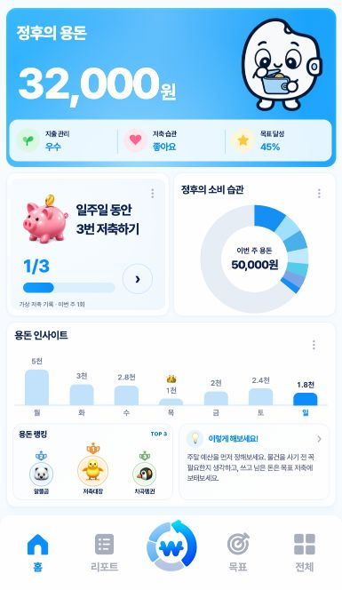

# 포켓WON TOP 3 랭킹 카드

2026-10-04. ‘이런 점이 좋아요!’의 강점 문구와 점수를 첨부한 랭킹 배치로 교체했다.

## 화면

- 제목은 ‘용돈 랭킹’, 우측은 ‘TOP 3’다. 왼쪽 2위·중앙 1위·오른쪽 3위 순서다.
- 1위는 큰 원형 병아리 프로필과 주황색 메달을 위로 올려 강조했다. 2위는 파랑 메달·곰, 3위는 초록 메달·펭귄이다. 프로필 아래에는 짧은 닉네임을 둔다.
- 순위는 숫자와 위치로도 구별한다. 원형 프로필의 비율은 유지한다. 전체 카드가 하나의 버튼이며 내부 중첩 버튼은 없다.
- 상세 전구 조언, Hero·도넛·주간 그래프, 84px 하단바는 유지한다. 기존 홈의 점수 모델과 리포트 점수 계산도 보존한다.

## 데이터와 동작

실제 사용자 랭킹 API나 계정 시스템은 없다. 기본 데모에만 가상 닉네임·순위를 넣었으며 실제 거래나 습관 점수에서 사용자 순위를 추정하지 않는다. 실제 기록 모드는 ‘랭킹 연동 준비 중’을 표시한다.

카드를 누르면 예시 랭킹이라는 설명과 기존 습관 리포트로 가는 버튼이 열린다. Escape·닫기 후 카드에 포커스를 돌려준다. 랭킹 클릭이나 데이터 전환은 금융 저장을 호출하지 않는다. 데모 기록·목표 저장 차단도 유지한다.

## 변경과 검증

- `scripts/home.js`: 읽기 전용 랭킹 상태, TOP 3 렌더링, 메달 SVG, 안내·리포트 연결.
- `scripts/demo.js`: 예시 순위 3개. 실제 모드는 빈 목록.
- `styles/home.css`: 순위별 색, 원형 프로필, 중앙 강조, 좁은 화면·글자 확대 대응. 이전 홈 점수 카드 스타일 제거.
- `index.html`: 내용 해시로 캐시 갱신. 로컬 배포 미러 동기화.
- 기존 데이터·이동·도넛·저장 검사에서 이전 점수 카드 기대값을 갱신했다. `verify-ranking-card.cjs`에서 새 카드의 배치와 상호작용을 검사한다.

검증 결과:

- `evidence/RANKING-CARD/layout-final/verification.json`: Chromium·WebKit의 20개 배치. 320/360/385/390/430px, 가로 667×375·844×390, 데스크톱 1440×900, safe area, 200% 글자. 프로필 원형·순위 위치·1위 크기·이름과 메달 겹침·카드 경계·문서 overflow·84px 하단바 통과.
- 같은 검사에서 데모 고지, 키보드 진입, 모달 포커스 유지·복원, 습관 리포트·뒤로 가기, 실제 모드의 랭킹 미연동 표시 통과.
- `data/verification.json`: 데모/실제 기록 전환, 기존 거래 합계·리포트 점수, 기록·목표 저장 차단, 저장 쓰기 0회.
- `purchases/verification.json`: 양 브라우저 도넛 10% 구간, hover·클릭·터치·키보드, 구매 상세·목록, 왕관, 7가지 데이터 예외 상태 통과.
- `navigation/verification.json`: 기존 이동·메뉴 포커스, 읽기 오류·긴 금액·빈 기록·글자 확대 검사 통과.
- Node 데이터 검사 10그룹 통과. 금융 계산·저장 스키마·키와 캐릭터 원본·시트·재생 코드는 수정하지 않았다.
- `delivery/delivery-integrity.json`: 앱·미러 85개 파일 일치, 과거 증거·원본 1,168개 해시 보존.

가로 화면의 첫 보정에서 발견한 닉네임 하단 넘침은 카드 내부 간격과 메달 높이를 조정해 해결했다. `first-pass/`, `layout/`의 초기 캡처와 실패 결과도 보존한다. 아주 작은 화면의 글자 축소는 기존 fullscreen 정책이다. 물리 기기 검증과 실제 사용자 순위 집계는 수행하지 않았다.

## 공개 반영

- 소스 커밋 `0cc5eea`을 `pocketWON/pocketWON` main에 푸시했다.
- 기존 공개 앱: https://pocketwon.vercel.app/
- 배포 ID: `dpl_AcREiaUDCHhoh9HRQGrwHXoAQT2d`
- 배포 주소: https://pocketwon-b3autimme-clcocloud.vercel.app
- `production/verification.json`에 공개 HTML·변경 JS·CSS의 HTTP 응답 및 로컬 파일과의 SHA-256 일치 결과를 기록한다.
- `production/live-app.jpg`는 최신 소스를 연 실제 로컬 인앱 브라우저 화면이다. 사용자의 기존 앱 탭을 새로고침해 열어두었다.
