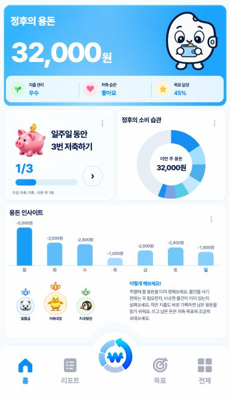

# 주간 지출 금액·블루 막대와 랭킹 배치

2026-10-04. ‘용돈 인사이트’ 막대 위의 축약 금액을 `-1,000원`처럼 쉼표·원 단위가 포함된 전체 지출액으로 바꿨다. 실제 0원은 `0원`, 미확인·미래는 `—`를 유지한다. 아주 긴 금액은 각 날짜 열 안에서 줄바꿈하고 차트 위쪽 공간을 확보한다.

왕관을 제거했다. 이번 주 최대 지출 대비 비율로 막대의 높이와 색을 함께 정한다. 색은 연한 `#C7EAFF`부터 밝은 `#189EF7`까지의 단색 블루다. 적게 쓴 날은 연하고 많이 쓴 날은 진하며, 같은 지출액은 같은 색이다. 오늘을 진한 막대로 덮어쓰던 규칙은 제거하고 요일 글자의 파란 강조만 유지한다. 왕관의 공간을 막대 높이에 반영했다.

금융 집계·저장 API와 도넛·랭킹·조언·캐릭터는 유지한다. 기존 모델의 `crownKey` 필드는 호환성을 위해 보존하며 홈에서는 더 이상 사용하지 않는다. 변경 파일은 `scripts/home.js`, `styles/home.css`, 캐시 해시를 갱신한 `index.html`, 관련 테스트와 로컬 미러다.

## 검증

- `evidence/WEEKLY-SPEND-BLUE/purchases/verification.json`: Chromium·WebKit에서 전체 금액 표기, 왕관 없음, 같은 금액의 같은 색, 지출 증가에 따른 블루 진하기, 밝은 팔레트 범위, 금액과 이웃 열의 겹침 없음 확인. 기존 도넛 터치·키보드·상세 이동 및 빈 기록·읽기 오류·정수 범위 초과·매우 긴 금액 등의 상태도 통과했다.
- `evidence/WEEKLY-SPEND-BLUE/layout/verification.json`: 작은 휴대폰·390×844·가로 화면·데스크톱·safe area·200% 글자·긴 금액·읽기 오류 등을 두 엔진에서 검사했다. 카드 경계, 기존 내비게이션, 포커스 복원, 캐릭터 간격, fullscreen/84px 하단바 통과.
- `delivery/delivery-integrity.json`: 앱·미러 85파일 일치, 기존 증거·원본 1,168개 해시 보존.
- `production/live-app.jpg`: 사용자가 열어 둔 실제 로컬 앱에서 확인한 최종 화면. 기존 증거 폴더는 보존했다.

## 랭킹 카드 후속 보정

홈의 ‘용돈 랭킹’과 ‘TOP 3’ 제목 줄을 제거하고 기존 2위·1위·3위 구성만 남겼다. 프로필은 중앙 46→54, 양옆 36→42 디자인 px로 약 17% 확대하고 메달·동물 그림도 비례해서 키웠다. 랭킹/조언 열 비율은 1.065:1→1.12:1, 간격은 8→6 디자인 px로 조정했다. 전체 내용은 카드 세로 중앙에 배치한다.

접근성 이름과 눌렀을 때의 안내, 예시 순위·실제 모드 미연동 상태는 유지한다. `evidence/RANKING-EXPANDED/layout/verification.json`의 양 엔진 20개 배치·원형 비율·1위 강조·옆 조언 문구 경계·키보드·포커스·리포트 연결 검사를 통과했다. `delivery/`의 85파일 미러 일치 및 1,168개 과거 해시도 확인했다.

## 32,000원 도넛과 스카이블루 표면

기본 데모의 이번 주 받은 용돈을 50,000→32,000원으로 바꿨다. 구매 합계는 18,000원으로 유지해 구매 영역이 36%→56.25%로 커진다. 문구 세트 5,000원의 비중은 15.625%이며 이번 주 남은 영역은 14,000원(43.75%)이다. 상단의 전체 잔액 32,000원은 이전 주에 받은 18,000원과 이번 주 잔액을 합친 값이다. 이를 위한 지난주 이월 예시 거래는 주간 집계에서 제외되고, 전체 기록에서 확인할 수 있다. 숫자만 덮어쓰지 않고 같은 거래 집합으로 비율과 금액을 계산한다. 실제 기록 모드와 저장 스키마는 바꾸지 않았다.

저축 미션의 내부 배경을 `--pw-home-sky-surface`로 공유해 랭킹·조언 카드 전체에도 동일한 `#FDFEFF`~`#F7FCFF`의 매우 연한 스카이블루를 채웠다. 기존 프로필·문구·배치는 유지한다.

- `evidence/SKY-CARDS-32K/data/verification.json`: 두 브라우저의 주간/전체 합계, 이월 구분, 리포트 점수 일치, 실제 모드 복원, 저장 차단·쓰기 0회 확인.
- `purchases/verification.json`: 22개 배치와 도넛의 15.625%·총 구매 56.25% 구간, hover/터치/키보드, 14,000원 잔여 영역·32,000원 초기 표시, 상세·목록 연결과 예외 상태 확인.
- `surface/verification.json`: 두 엔진에서 미션·랭킹·조언의 계산된 배경이 일치함을 확인하고 화면 캡처를 보존했다.
- 데이터 모델의 기존 50,000원/5,000원=10% 사례를 포함한 Node 10그룹 통과. 원래 계산 계약은 그대로다.
- `delivery/`: 앱·미러 85파일 일치와 과거 증거·원본 1,168개 해시 보존.

## 밝기 후속 보정과 하단바 복원

미션·랭킹·조언 배경을 흰색에 가까운 하늘색 `#FDFEFF`~`#F7FCFF`로 한 번 더 밝게 조정했다. 하단바의 파란 배경 시안은 사용자 요청에 따라 철회하고, 기존 흰 표면·파랑 활성 아이콘·청회색 비활성 아이콘·중앙 원본 로고로 복원했다. 기존 84px 높이와 배치는 그대로다.

`evidence/PALE-SKY-CARDS/verification.json`에서 Chromium·WebKit의 세 카드 배경 일치, 원래 하단바 색상, 84px 높이, 문서 스크롤 없음을 확인했다. `delivery/`에서 로컬 미러 85파일 일치와 기존 원본·증거 1,168개 보존을 확인했다. `evidence/BLUE-NAV/`는 철회한 시안의 중간 검증 기록으로 보존하며 최종 디자인 증거로 사용하지 않는다.

## 중앙 로고 돌출과 반원 받침

하단바 중앙 로고 버튼은 60×60px을 유지하며 위로 18px 올렸다. 뒤에는 하단바와 동일한 흰색의 80×40px 반원 받침을 두고, 그중 24px이 하단바 위로 나오게 했다. 콘텐츠 영역에 32px을 예약해 반원 꼭대기와 최소 8px 간격을 확보한다. 하단바 자체 높이는 84px이며 모든 탭에서 위치·크기를 공유한다. 입력 모달도 같은 간격을 확보하고, 키보드가 열린 경우에는 기존 화면 맞춤 규칙을 유지한다. 원본 로고 이미지와 클릭 동작은 그대로다.

- `evidence/RAISED-NAV/routes/verification.json`: Chromium·WebKit의 작은 휴대폰·가로 화면·데스크톱·safe area·글자 확대에서 탭/기능 화면 전환 후 내비게이션 크기·중앙 위치와 콘텐츠 간격 검증.
- `interaction.json`: 두 엔진, 세 화면 크기에서 중앙 로고 클릭·기록 모달 간격·닫기 후 원래 버튼 포커스 복원·저장 변경 없음 검증.
- `delivery/`: 앱·미러 85파일 일치, 과거 증거·원본 1,168개 보존.

## 두 내부 카드의 표면 제거

랭킹·‘이렇게 해보세요!’ 버튼의 배경과 테두리만 투명하게 변경했다. 바깥 용돈 인사이트 박스와 미션 배경, 패딩·열 비율·위치·크기·내용·클릭 동작은 유지한다. Chromium·WebKit에서 이전 배치 좌표와 내용이 모두 일치하고, 두 내부 표면만 투명함을 확인했다. 증거는 `evidence/OPEN-INNER-CARDS/`에 보존한다.

## 표시된 아래 공간 확장

첨부 표시선을 기준으로 용돈 인사이트의 양옆 아래 경계를 28 CSS px 확장했다. 같은 만큼 내부 아래 여백을 늘려 그래프·랭킹·조언의 내용 좌표는 유지한다. 중앙에는 반경 48px의 곡선으로 로고 공간을 비웠다. 하단바·버튼·원본 로고 크기와 위치는 그대로이며, 기존 확대 글자 모드의 배치는 유지한다.

`evidence/EXTENDED-INSIGHTS/verification.json`에 Chromium·WebKit, 작은 휴대폰·390×844·가로 화면·데스크톱의 내용 좌표 보존, 아래 28px 증가, 로고 간격과 버튼 동작을 기록했다. 이전 증거와 로컬 미러도 보존했다.

## 확보한 공간 안의 랭킹·조언 배치

랭킹·조언을 같은 폭의 두 열로 맞추고 사이 간격을 40px로 넓혔다. 내부 줄만 14px 아래로 내려 앞서 확보한 28px의 공간을 활용한다. 외부 박스·곡선·그래프·파란 카드·하단바는 유지한다. 확대 글자 모드에서는 기존 수직 위치를 유지한다.

`evidence/LOWER-INNER-CONTENT/layout/verification.json`의 양 엔진 20개 배치·내용 경계·랭킹 크기 비율·실제 모드 안내·키보드 포커스·리포트 이동 검사를 통과했다. `logo-clearance.json`에서 글자와 프로필이 곡선의 잘림 영역에 들어가지 않는지 별도로 확인했다.

## 조언 장식 정리와 긴 막대그래프

‘이렇게 해보세요!’의 전구와 오른쪽 화살표 DOM을 제거하고 사용하지 않는 아이콘 CSS를 정리했다. 조언 제목·본문을 랭킹 프로필 묶음과 세로 중앙에 맞췄다. 모바일 세로 구성에서는 내려간 인사이트 위 14px 여유 공간을 주간 그래프 높이에 배분했다. 최대 막대의 상단은 유지하며 바닥을 14px 내리고 나머지 막대도 지출 비율에 맞춰 길어진다. 데스크톱의 가로 구성과 확대 글자 모드에는 기존 그래프 높이를 유지한다.

- `evidence/LONGER-BARS/geometry.json`: 양 엔진 8개 화면에서 장식 제거, 조언/랭킹 중앙 오차 1px 미만, 그래프 증가, 파란 카드·하단바·랭킹 버튼 배치 보존 확인.
- `final-ranking/verification.json`: 긴 조언 문구를 포함한 최종 20개 배치와 랭킹 키보드·포커스·리포트 이동·실제 모드 안내 확인.
- `purchases/verification.json`: 도넛 구간·상세·저장 격리, 전체 원 금액 라벨, 블루 막대 비율과 예외 상태 확인.
- `delivery/`: 로컬 미러 85파일 일치와 기존 증거·원본 1,168개 해시 보존.

조언은 117자로 늘려 주말 예산 정하기, 구매 필요와 중복 물건 확인, 작은 지출 기록, 남은 돈 저축을 자연스럽게 안내한다. 기존 글자 크기를 유지하고 조언의 좌우 여백을 3px로 정리해 전체 문장을 표시한다. 390px에서 길어진 문구가 넘친 첫 시안은 `long-copy-first-pass/`에 남기고 보정 후 최종 배치를 다시 검증했다. `geometry.json`은 가로 화면의 나란한 배치를 별도로 판정하며, 모든 글자·프로필이 로고 곡선에 잘리지 않음을 확인한다.

## 공개 반영

주간 그래프와 랭킹 확대에 이어 32,000원 도넛 `edf30cb`, 밝은 카드 표면 `fbdec7e`, 중앙 로고 돌출 `1b42404`를 main에 푸시하고 함께 공개 배포했다. 하단바 색상은 기존 흰 배경·파랑/청회색 아이콘으로 복원한 상태다.

- 공개 앱: https://pocketwon.vercel.app/
- 배포 ID: `dpl_9FaZNTpmLj8w9ptZ3q2r1tYKTAo4`
- 배포 주소: https://pocketwon-87hqhsjf8-clcocloud.vercel.app
- `evidence/RAISED-NAV/production/verification.json`: 공개 HTML·demo.js·home.css·tokens.css·viewport.css의 HTTP 200 및 로컬 SHA-256 일치 검증.
- 두 브라우저의 화면·전환 224건, 중앙 버튼·기록창 상호작용 6건 통과.
- 사용자의 기존 로컬 앱 탭을 새로고침해 최종 화면을 열어두었다.

두 내부 카드 표면 변경 `928cb0c`도 main에 푸시하고 배포했다. 최종 배포 ID는 `dpl_3MKTmtRJX2docsy8hAxzsAkW6J61`, 배포 주소는 https://pocketwon-7lzsiil0q-clcocloud.vercel.app 이다. `evidence/OPEN-INNER-CARDS/production/verification.json`에서 공개 HTML·home.css와 로컬 파일 일치를 확인했다.

아래 영역 확장 `829afbf`와 두 내용의 간격·수직 위치 변경 `69d242b`를 함께 공개 배포했다. 최종 배포 ID는 `dpl_6qkXCXg7gqriBeHcv1m6KwdUvdqt`, 배포 주소는 https://pocketwon-4n0mjmlfq-clcocloud.vercel.app 이다. 공개 파일 일치 검증은 `evidence/LOWER-INNER-CONTENT/production/verification.json`에 기록했다.

막대그래프 확대·조언 장식 제거·117자 조언 변경 `792f479`를 공개 배포했다. 최종 배포 ID는 `dpl_48Ev44qc6npqJqWtjsEFAJjqqKqq`, 배포 주소는 https://pocketwon-jruzc3ow5-clcocloud.vercel.app 이다. `evidence/LONGER-BARS/production/verification.json`에서 공개 HTML·home.js·home.css·viewport.css와 로컬 파일의 일치를 확인했다.
