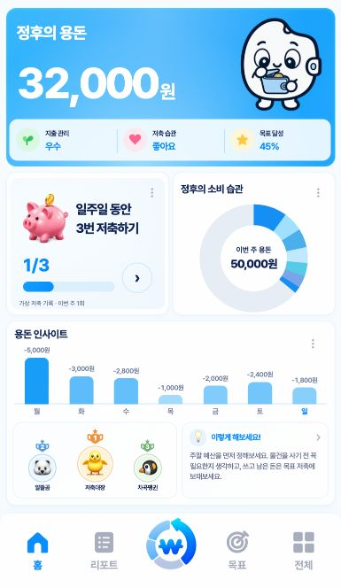

# 주간 지출 금액·블루 막대와 랭킹 배치

2026-10-04. ‘용돈 인사이트’ 막대 위의 축약 금액을 `-1,000원`처럼 쉼표·원 단위가 포함된 전체 지출액으로 바꿨다. 실제 0원은 `0원`, 미확인·미래는 `—`를 유지한다. 아주 긴 금액은 각 날짜 열 안에서 줄바꿈하고 차트 위쪽 공간을 확보한다.

왕관을 제거했다. 이번 주 최대 지출 대비 비율로 막대의 높이와 색을 함께 정한다. 색은 연한 `#C7EAFF`부터 밝은 `#189EF7`까지의 단색 블루다. 적게 쓴 날은 연하고 많이 쓴 날은 진하며, 같은 지출액은 같은 색이다. 오늘을 진한 막대로 덮어쓰던 규칙은 제거하고 요일 글자의 파란 강조만 유지한다. 왕관의 공간을 막대 높이에 반영했다.

금융 집계·저장 API와 도넛·랭킹·조언·캐릭터는 유지한다. 기존 모델의 `crownKey` 필드는 호환성을 위해 보존하며 홈에서는 더 이상 사용하지 않는다. 변경 파일은 `scripts/home.js`, `styles/home.css`, 캐시 해시를 갱신한 `index.html`, 관련 테스트와 로컬 미러다.

## 검증

- `evidence/WEEKLY-SPEND-BLUE/purchases/verification.json`: Chromium·WebKit에서 전체 금액 표기, 왕관 없음, 같은 금액의 같은 색, 지출 증가에 따른 블루 진하기, 밝은 팔레트 범위, 금액과 이웃 열의 겹침 없음 확인. 기존 도넛 터치·키보드·상세 이동 및 빈 기록·읽기 오류·정수 범위 초과·매우 긴 금액 등의 상태도 통과했다.
- `evidence/WEEKLY-SPEND-BLUE/layout/verification.json`: 작은 휴대폰·390×844·가로 화면·데스크톱·safe area·200% 글자·긴 금액·읽기 오류 등을 두 엔진에서 검사했다. 카드 경계, 기존 내비게이션, 포커스 복원, 캐릭터 간격, fullscreen/84px 하단바 통과.
- `delivery/delivery-integrity.json`: 앱·미러 85파일 일치, 기존 증거·원본 1,168개 해시 보존.
- `production/live-app.jpg`: 사용자가 열어 둔 실제 로컬 앱에서 확인한 최종 화면. 기존 증거 폴더는 보존했다.

## 랭킹 카드 후속 보정

홈의 ‘용돈 랭킹’과 ‘TOP 3’ 제목 줄을 제거하고 기존 2위·1위·3위 구성만 남겼다. 프로필은 중앙 46→54, 양옆 36→42 디자인 px로 약 17% 확대하고 메달·동물 그림도 비례해서 키웠다. 랭킹/조언 열 비율은 1.065:1→1.12:1, 간격은 8→6 디자인 px로 조정했다. 전체 내용은 카드 세로 중앙에 배치한다.

접근성 이름과 눌렀을 때의 안내, 예시 순위·실제 모드 미연동 상태는 유지한다. `evidence/RANKING-EXPANDED/layout/verification.json`의 양 엔진 20개 배치·원형 비율·1위 강조·옆 조언 문구 경계·키보드·포커스·리포트 연결 검사를 통과했다. `delivery/`의 85파일 미러 일치 및 1,168개 과거 해시도 확인했다.

## 공개 반영

배포 완료 후 공개 파일 해시와 소스 커밋을 기록한다.
