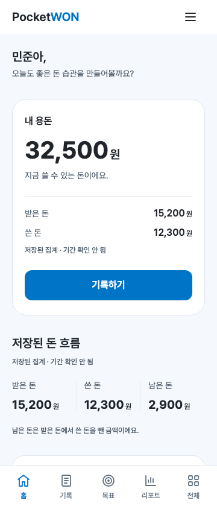
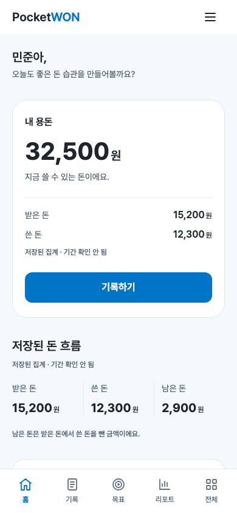
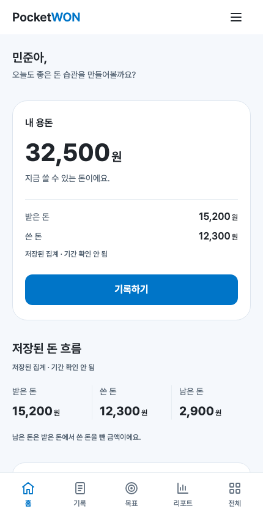
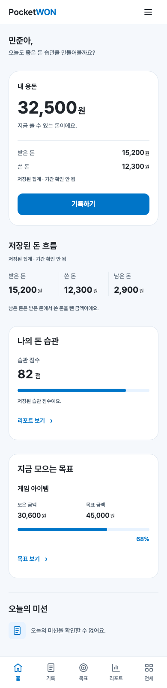

# PW-WOORI-02 — 홈 화면 완료 보고

## 1. 변경 파일 목록

활성 앱: 진입 HTML과 앱 탐색 코드 수정, `scripts/state.js`, `scripts/home.js`, `styles/home.css` 추가.
검증·문서: Shell 검사 수정, 홈 검사 추가, README 수정, 본 보고서 추가.

- [전체 변경 목록](../evidence/PW-WOORI-02/changed-files.md)
- [소스·테스트·문서 전체 diff](../evidence/PW-WOORI-02/source.patch)
- [산출물·해시 명세](../evidence/PW-WOORI-02/delivery.json)

승인된 tokens.css/base.css/shell.css/icons.js/tabs.js와 과거 자료를 포함한 기존 46개 파일은 바이트 동일합니다. 네 placeholder의 3개 폭 스크린샷 12개도 PW-WOORI-01과 바이트 동일합니다. Git 저장소가 아니므로 변경 대상 4개 원본을 `preservation/PW-WOORI-02/originals`에 비실행 텍스트로 보존하고 구현 전 50개 파일의 SHA-256을 기록했습니다.

## 2. 홈 데이터 출처

앱은 `pocketwon_demo_v1`만 읽습니다. 데이터 계약은 원본 스냅샷의 defaultState(1512행), loadState(1569행), 기록 저장 처리(1981행 이후), 목표/미션 로직에서 확인했습니다. 원본 HTML 화면·디자인·로직 전체를 다시 활성화하지 않았습니다.

| 표시 | 기존 필드·계산 | 의미와 경계 |
|---|---|---|
| 인사 | user.name | 유효한 문자열만 사용, 이름 없음은 개인화 생략 |
| 내 용돈 | balance | 0 이상 안전한 정수, 실제 0과 누락 구분 |
| 받은 돈 | monthly.saving | 기존 입금 기록 시 증가하는 누계, 저축액으로 재해석하지 않음 |
| 쓴 돈 | monthly.spending | 기존 지출 누계 |
| 남은 돈 | saving − spending | 음수도 표시, balance와 구분 |
| 습관 점수 | habitScore | 0~100의 유효한 숫자만 표시, 새로운 분석·증감 없음 |
| 대표 목표 | goal.title/current/target | 단일 목표 구조, 유효한 미완료 목표만 진행 카드로 표시 |
| 오늘의 미션 | missions의 날짜 유무 | boolean 배열에는 날짜가 없어 오늘의 상태를 확인할 수 없음 |

monthly에는 연월 식별자가 없으므로 제목은 **저장된 돈 흐름**, 보조 문구는 **저장된 집계 · 기간 확인 안 됨**입니다. 거래 내역의 일부 합계나 오래된 날짜로 이번 달 값을 추정하지 않습니다. missions의 과거 주간 완료값을 오늘의 완료로 취급하지 않습니다.

## 3. 새 state / Home ViewModel 구조

```js
loadPocketWONState()
// { status: 'loaded' | 'empty' | 'invalid' | 'unavailable', state: object | null }

createHomeViewModel(state)
// {
//   greeting: { name: string },
//   balance: number | null,
//   monthly: { received, spent, remaining, period: 'unknown' },
//   habit: { score: number | null },
//   goal: { status: 'empty' | 'invalid' }
//      | { status: 'active' | 'complete', title, current, target, percent },
//   mission: { status: 'unavailable' }
// }

createHomeView(viewModel, navigate, loadStatus)
// { element, mount(), dispose() }
```

로더는 저장소 오류를 정규화하며 ViewModel 계산은 순수 함수입니다. 누락 필드를 다른 사용자·데모 값으로 채우지 않습니다. 돈은 음수가 아닌 안전한 정수인지 확인하고, 집계 차액만 음수를 허용합니다. 목표 비율은 0~100%로 제한하며 달성한 목표는 완료 안내를 표시합니다. 금액이 공간을 넘으면 만/억/조/경 단위의 근삿값과 정확한 원 단위 금액을 함께 제공하며, 접근성 이름에는 정확한 금액을 유지합니다.

## 4. localStorage 읽기 / 쓰기

- 런타임: `getItem('pocketwon_demo_v1')`만 사용. 초기 홈 및 홈 재진입 시 읽습니다.
- 런타임 `setItem` / `removeItem` / `clear`: **0회**. 원본 데이터 변경·자동 마이그레이션·초기화 없음.
- theme/intro/무관 키: 읽거나 변경하지 않음.
- 정상·오류 상태의 탐색·새로고침에서 저장 문자열 동일성 확인.
- fixture 준비의 쓰기는 **격리된 임시 Playwright context 안에서 계측 시작 전**에만 수행. 실제 사용자 브라우저를 열거나 데이터를 주입하지 않음.
- preservation의 .txt를 앱에서 import/fetch하지 않음. 앱에 defaultState 없음.

## 5. 360×844 screenshot



## 6. 390×844 screenshot



## 7. 430×844 screenshot



## 8. 390×844 전체 페이지 screenshot



위 네 장은 **원본 defaultState를 주입한 격리 검수 fixture**입니다. 잔액 32,500원·점수 82점·목표 진행률 68%는 원본 값/계산이며 사용자 실제 잔액을 주장하지 않습니다. 실제 실행 시 저장소가 비어 있으면 [빈 상태](../evidence/PW-WOORI-02/screenshots/fallback-empty.png)가 표시됩니다.

일반 캡처는 실제 844px viewport입니다. 전체 캡처는 390×844 viewport의 별도 검수 페이지에 촬영 전용 CSS로 Shell 높이를 auto, 내부 스크롤을 visible로 바꿔 Header부터 마지막 콘텐츠와 Nav까지 캡처했습니다. 앱 코드의 내부 스크롤 구조에는 이 CSS를 반영하지 않았습니다.

## 9. 기록하기 → 기록

Chromium / WebKit PASS. `record` 선택 표시, 제목·본문 ‘기록’, URL 유지, 목적지 h1 포커스를 확인했습니다. 입력 화면은 구현하지 않았습니다.

## 10. 목표 보기 → 목표

Chromium / WebKit PASS. `goal` 선택 표시, 제목·본문 ‘목표’, 목적지 포커스 확인. 목표 없음·오류 상태에서도 동일한 이동을 확인했습니다. 생성/수정 화면은 구현하지 않았습니다.

## 11. 리포트 보기 → 리포트

Chromium / WebKit PASS. `report` 선택 표시, 제목·본문 ‘리포트’, 목적지 포커스 확인. 상세 리포트는 구현하지 않았습니다. 전체 메뉴는 기존 ‘전체’ placeholder로 이동합니다.

## 12. fallback 검증

정상/부분 객체, 빈 저장소, JSON 오류, 잘못된 루트, 저장소 getter/read 예외, 실제 0, 문자열/음수/무한대/안전 정수 초과 금액, 점수 범위, 목표 없음/잘못된 목표/달성·초과 달성, 날짜 없는 미션을 검사했습니다. 동결된 원본 객체로 ViewModel을 생성하고 불변성을 확인했습니다.

브라우저에서는 360/390/430×844, 360×640, 세 폭의 root 200%, safe area 주입, 최대 안전 정수, 음수 차액, 긴 목표·이름, HTML 형태의 문자열을 검사했습니다. 금액 표현과 CTA의 가로 넘침, document/content 가로 overflow, 마지막 모듈의 Nav 가림은 없습니다. 집계는 정상 크기에서 3열, 확대 시 1열입니다. 사용자 문자열은 textContent로 표현합니다.

## 13. accessibility / 시각 검증

- Chromium / WebKit: h1 1개와 6개 section h2, 목표 이름 h3, 이름·범위·현재값을 가진 progress 확인.
- 실제 button, icon-only 메뉴의 이름, 장식 SVG aria-hidden, 터치 영역 48px 이상.
- Tab 순서, focus-visible 2px, Enter/Space 동작, 홈 액션 전환의 목적지 제목 포커스 확인.
- 실제 surface 위의 텍스트 대비 최솟값 **4.796:1**. 상태는 문구로 전달합니다.
- [접근성 트리](../evidence/PW-WOORI-02/accessibility-tree.txt), [200% 확대 캡처](../evidence/PW-WOORI-02/screenshots/360x640-200percent.png).
- 실물 기기·스크린리더 사용성 테스트와 axe 감사는 수행하지 않았습니다. 위 결과는 실제 브라우저 DOM·키보드·수치 검증 범위입니다.

요청한 시각 품질 자체 점검은 10항목 모두 YES입니다. 밝은 배경·흰 카드·여백·숫자 중심 위계와 승인된 Shell을 유지했고, 채워진 Blue CTA는 한 개입니다. 인사/집계는 카드 밖에 두고, 3개 주요 카드와 작은 미션 영역으로 구성했습니다. 성인 금융 용어·캐릭터·무지개색·gradient·shadow는 없습니다. 어린이 문구와 작은 아이콘만 사용하며, 확인 불가능한 게임/미션 상태는 장식으로 보충하지 않았습니다. 이는 자체 검수이며 공식 우리WON 내부 UI와의 일치 인증을 의미하지 않습니다.

## 14. console error / failed resource 결과

홈 **44개 검증 묶음 PASS**, Shell **46개 검증 묶음 PASS**, 합계 **90개**입니다.

- Chromium 151.0.7922.34 / WebKit 26.5.
- 최종 실행의 console error / page error: **0건**.
- 실패 요청 / HTTP 4xx·5xx 리소스: **0건**.
- 초기 WebKit 검사에서 발견한 ResizeObserver 알림 루프는 너비 변경만 감지하고 DOM 갱신을 다음 프레임으로 분리하여 해결한 뒤 전체 검사를 다시 통과했습니다.
- 프레임워크 build/lint가 없는 정적 프로젝트입니다. JavaScript 구문 검사와 실제 브라우저 검증을 수행했습니다. 외부 폰트는 기존 CDN을 유지하며 서버 폰트 장애 시 시스템 폰트로 대체됩니다.

재현: README의 localhost 정적 서버를 실행한 상태에서 아래 명령을 실행합니다. Playwright는 기존 개발 환경의 설치를 사용합니다. 필요한 경우 `PW_PLAYWRIGHT_MODULE`, `PW_CHROMIUM_EXECUTABLE`, `PW_WEBKIT_EXECUTABLE`, `PW_BASE_URL`을 지정할 수 있습니다.

```sh
node --check ks6s3juocjzc2.kimi.page/scripts/state.js
node --check ks6s3juocjzc2.kimi.page/scripts/home.js
node --check ks6s3juocjzc2.kimi.page/scripts/app.js
node --check tests/verify-home.cjs
node --check tests/verify-shell.cjs
node tests/verify-home.cjs
node tests/verify-shell.cjs
```

[홈 기계 판독 결과](../evidence/PW-WOORI-02/verification.json) · [Shell 결과](../evidence/PW-WOORI-02/shell/verification.json)

## 15. 전체 diff

[전체 구현 diff](../evidence/PW-WOORI-02/source.patch)는 활성 앱·검증 코드·README·본 보고서의 모든 변경을 구현 직전 원본과 비교합니다. 캡처·생성된 검증 결과·보존용 복사본은 제품 소스 diff와 구분하며, 전체 파일 목록과 SHA-256은 [delivery.json](../evidence/PW-WOORI-02/delivery.json)에 있습니다.

홈 구현 및 검수 자료 제출로 작업을 종료합니다. 다른 탭 개발·계좌 연결·포인트/미션 처리·API·DB·서버 개발·배포는 진행하지 않았습니다.
