# PW-WOORI-03 — 기록 화면 및 거래 저장 제출

기록 탭과 명시적 저장을 구현했습니다. **기록 64개 + 홈 44개 + Shell 46개 = 154개 검증 묶음 PASS**입니다. Chromium 151.0.7922.34 / WebKit 26.5에서 검사했습니다.

[23개 제출 항목 갤러리](../evidence/PW-WOORI-03/index.html) · [기계 판독 결과](../evidence/PW-WOORI-03/verification.json)

PW-WOORI-01/02 승인된 디자인을 유지합니다. 이번 보고서의 캡처는 격리된 임시 context의 원본 fixture·합성 데이터이며 실제 사용자 잔액이나 사용자 브라우저 저장소를 나타내지 않습니다.

## 1. 변경 파일 목록과 보존

[변경 파일](../evidence/PW-WOORI-03/changed-files.md) · [전체 파일 해시](../evidence/PW-WOORI-03/delivery.json)

활성 앱은 진입 HTML, state/app/icons 수정과 record.js/record.css 추가입니다. 닫기 아이콘 하나를 기존 라인 아이콘 집합에 추가했습니다. tests 3종과 제출 생성기, README, 본 보고서를 포함합니다.

Git 저장소가 아니므로 구현 전 91개 파일의 SHA-256과 변경 대상 7개의 원본을 비실행 텍스트로 보존했습니다. 변경 허용 원본을 제외한 84개 파일은 바이트 동일합니다. tokens/base/shell/home 스타일과 home.js/tabs.js, PW-WOORI-01/02 증거를 그대로 유지했습니다.

## 2. 기존 transaction schema 분석

원본 근거: [보존 HTML](../preservation/PW-WOORI-01/original-index.html.txt)의 defaultState(1512행), txRow(1805행), CATS(1857행), 기록 저장(1971행 이후).

```js
{
  type: 'in' | 'out',
  amount: number,
  category: string,
  ts: string,
  receipt: boolean,
  memo?: string // 사용자 승인된 선택적 확장
}
```

원본 거래에 ID·memo·date 필드는 없으며 날짜는 ts입니다. 초기 fixture는 timezone 없는 ISO 로컬 문자열이고 원본 저장은 `new Date().toISOString()`입니다. 새 기록도 저장 순간을 ISO UTC로 저장하고 로컬 시간으로 표시합니다. 카테고리는 받은 돈 `용돈` 1종, 쓴 돈 `간식/문구/게임/교통/기타` 5종입니다. 선물·보상·편의점 등 새 분류를 만들지 않았습니다.

원본처럼 거래 배열 맨 앞에 추가하고 새 거래는 `receipt: false`입니다. memo는 Unicode code point 기준 최대 50자, 양끝 공백 제거 후 비어 있으면 필드를 생략합니다. 기존 거래·알 수 없는 추가 속성은 유지합니다.

목록은 날짜가 모두 신뢰 가능하면 복사본을 최신순으로 정렬·그룹화합니다. 불명확한 날짜가 섞이면 저장 배열 순서를 유지하며 '날짜 확인 안 됨'으로 표시합니다. 원본 배열의 순서를 재저장하지 않습니다. 이전 연도의 날짜에는 연도를 함께 표시합니다. 잘못된 거래는 확인 불가 안내를 제공하고 저장을 막습니다.

## 3. 받은 돈 / 쓴 돈 저장 변경 필드

| 구분 | balance | monthly.saving | monthly.spending | transactions |
|---|---|---|---|---|
| 받은 돈 | +amount | +amount | 유지 | 새 in 거래를 앞에 추가 |
| 쓴 돈 | −amount | 유지 | +amount | 새 out 거래를 앞에 추가 |

원본의 monthly.saving은 받은 돈 누계로 유지하며 UI에 저축으로 노출하지 않습니다. monthly에 기간 식별자가 없어 월 초기화나 재계산을 하지 않습니다. habitScore·goal·monthly.goal·missions·points·recordedDays·streak 등은 변경하지 않습니다.

| 검증 | 저장 전 | 저장 후 |
|---|---|---|
| A. 쓴 돈 3,500원 | balance 32,500 / spending 12,300 | balance **29,000** / spending **15,800** |
| B. 받은 돈 10,000원 | balance 32,500 / saving 15,200 | balance **42,500** / saving **25,200** |
| 홈 남은 돈 | saving − spending | A **−600원**, B **12,900원** |

빈 키의 첫 유효 저장에만 `balance`, `monthly: {saving, spending}`, `transactions`를 생성합니다. 첫 기록 전에는 '확인 전'과 0원 시작 안내를 표시하며 데모 잔액·사용자·목표·점수를 채우지 않습니다. 0원 기준의 첫 지출은 잔액 부족으로 막습니다.

## 4. 새 state 함수 구조

| 함수 | 책임 |
|---|---|
| loadPocketWONState | loaded/empty/invalid/unavailable 구분, 읽기만 수행 |
| createRecordViewModel | 잔액·최근 20개·유효성·날짜 표시, 순수 변환 |
| validateRecordDraft | type/category/금액/메모/원본 상태/잔액/합산 범위 검증 |
| applyTransaction | 검증 후 새 state/monthly/transactions 생성, 원본 불변 |
| persistPocketWONState | 단일 setItem, saved/failed 반환 |

record.js는 View·native dialog·입력·제출 순서를 담당하고 app.js는 View 생성·해제와 탭 이동을 관리합니다. home.js는 수정하지 않았습니다.

## 5. localStorage write 조건

유효한 입력으로 **기록 저장 버튼을 마우스·터치·키보드로 활성화**했을 때만 `pocketwon_demo_v1`에 한 번 씁니다. 입력 중 Enter는 저장하지 않습니다.

제출 잠금 → 최신 storage 재조회 → 검증 → 새 상태 계산 → setItem → 성공 후에만 화면 갱신 순서입니다. 동일 Sheet의 연속 click/submit은 한 거래만 생성합니다. 입력·닫기·진입·tab 이동·reload는 쓰기 0회이며 theme/intro/무관 키는 읽거나 변경하지 않습니다.

저장 실패에는 Sheet·입력·기존 화면·저장 문자열을 유지하고 지정 문구를 표시합니다. 재시도는 최신 값을 다시 읽습니다. 손상·누락 상태 자동 복구나 마이그레이션은 없습니다. 받은 돈의 balance/saving 합산과 쓴 돈의 spending 합산도 safe integer를 확인합니다.

저장 직전 다른 상태로 변경된 경우와 키 삭제·읽기 오류를 실제 브라우저에서 검증했습니다. localStorage는 여러 탭에 대한 원자적 트랜잭션을 제공하지 않으므로 동시 탭 간 무손실 저장까지 보장하지 않습니다.

## 6. 기록 기본 화면 360×844

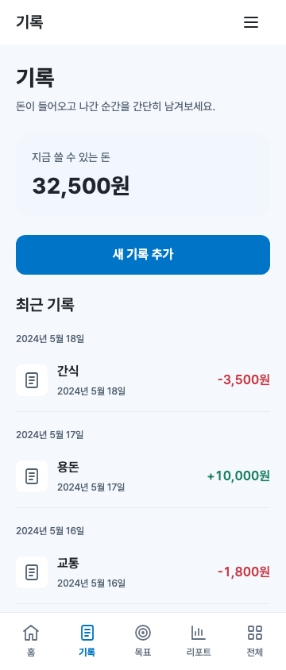

## 7. 기록 기본 화면 390×844

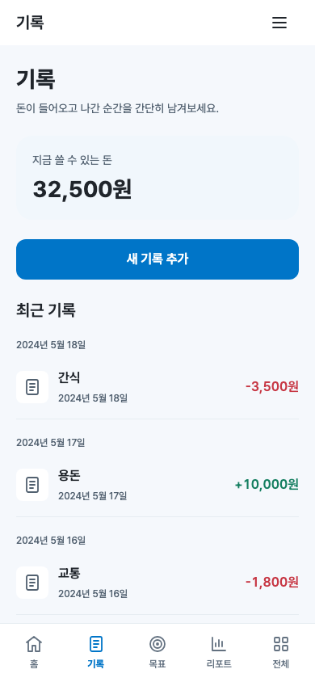

## 8. 기록 기본 화면 430×844

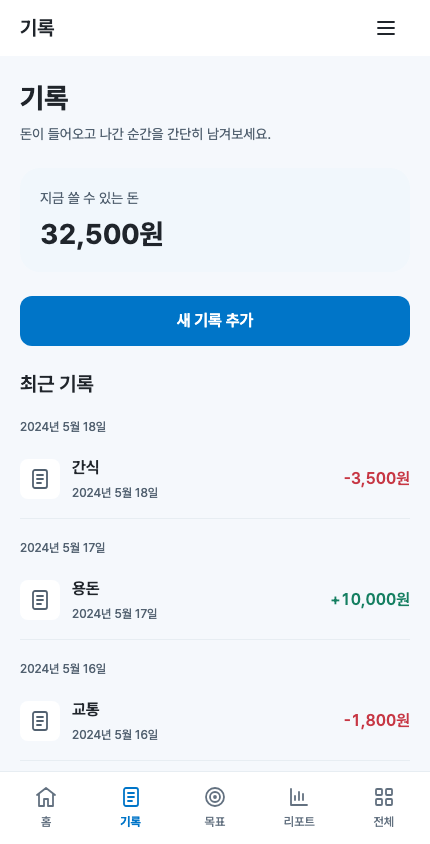

## 9. 새 기록 Sheet — 받은 돈

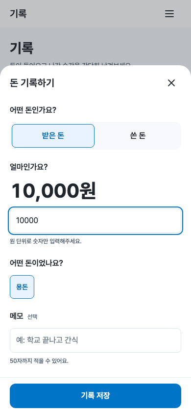

## 10. 새 기록 Sheet — 쓴 돈

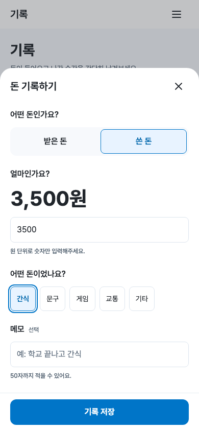

## 11. 카테고리 wrapping — root 200%

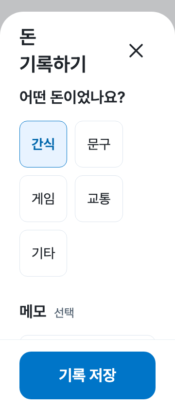

## 12. 금액 validation 오류

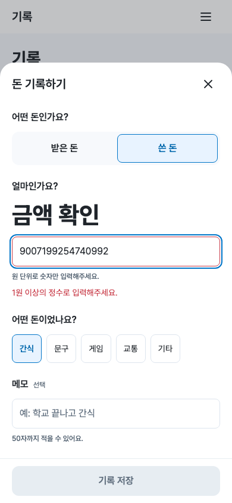

## 13. 잔액 부족

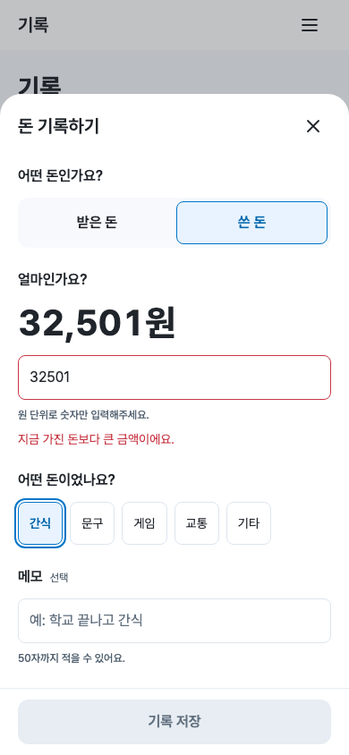

## 14. storage write failure

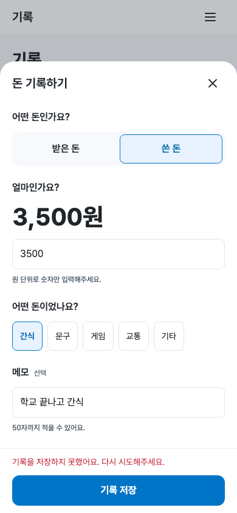

## 15. 빈 거래 목록

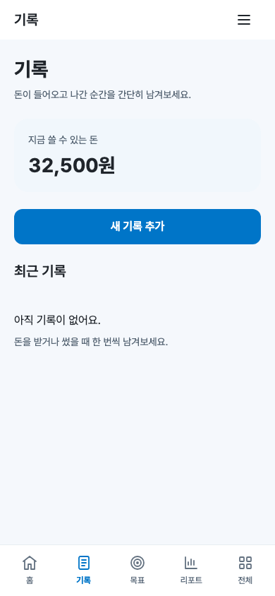

## 16. 최근 기록 다수 — 20개 제한

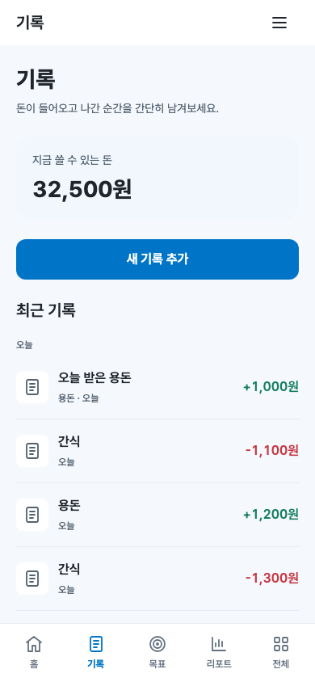

## 17. 저장 전/후 storage JSON diff

- [받은 돈 JSON](../evidence/PW-WOORI-03/storage-in.json) · [받은 돈 diff](../evidence/PW-WOORI-03/storage-in.diff)
- [쓴 돈 JSON](../evidence/PW-WOORI-03/storage-out.json) · [쓴 돈 diff](../evidence/PW-WOORI-03/storage-out.diff)

JSON diff는 격리 fixture의 저장 전후 구조를 읽기 좋게 정렬하지 않고 들여쓰기한 비교입니다. 실제 브라우저 검증은 실패·금지 경로에서 원래 저장 문자열의 동일성을 별도로 확인합니다. 타 키 문자열과 기존 거래, 비대상 필드의 동일성도 확인합니다.

## 18. 저장 후 홈 갱신 화면

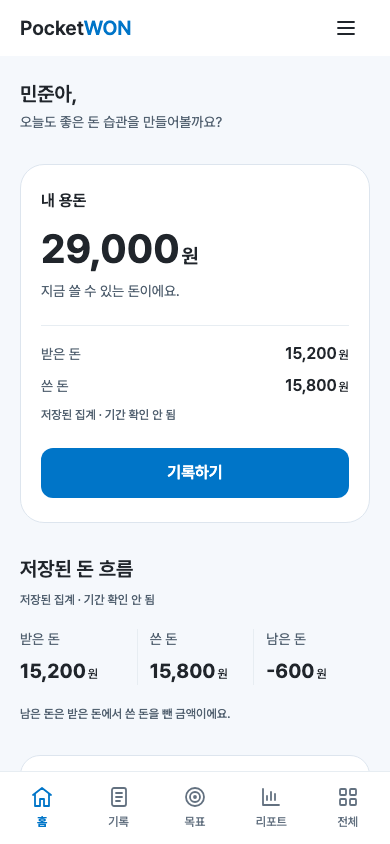

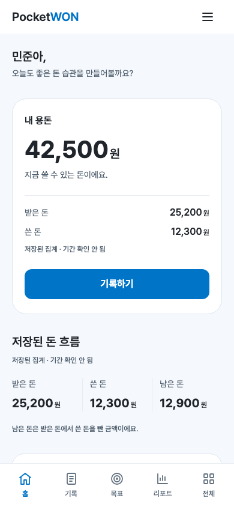

홈 재진입 시 로더를 다시 호출하는 기존 구조를 유지했습니다. balance·받은 돈·쓴 돈·남은 돈 네 값의 DOM·접근성 이름을 검사했습니다. 홈 디자인·레이아웃·문구는 변경하지 않았습니다. [시각 회귀 비교](../evidence/PW-WOORI-03/visual-regression.json)에서 360/390px 홈은 픽셀 동일, 430px은 카드 테두리의 19픽셀에서 채널값 최대 1 차이만 관찰됐습니다. 430px 이미지가 바이트 동일하다고 주장하지 않습니다. 세 placeholder의 3개 폭 이미지 9개는 바이트 동일합니다.

## 19. reload persistence 검증

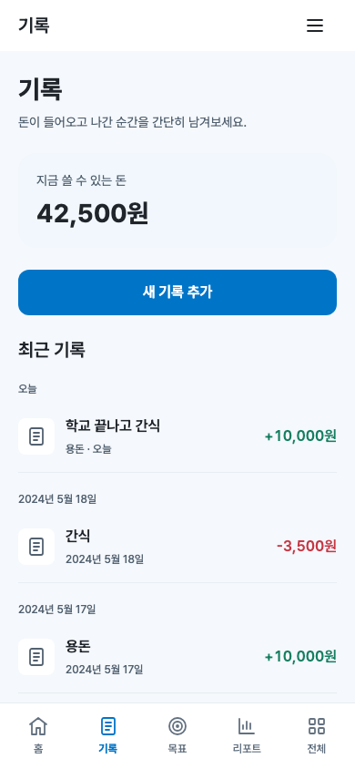

두 거래 유형 모두 저장 문자열과 새 거래가 reload 후 유지됩니다. reload는 홈으로 돌아가는 기존 동작을 유지하고 기록 탭에 재진입해 확인했습니다. reload 이후 저장 호출은 0회입니다.

## 20. keyboard / accessibility / 반응형

[접근성 트리](../evidence/PW-WOORI-03/accessibility-tree.txt)

- native modal dialog 이름·제목, native radio fieldset/legend, label/input 연결, 오류 aria-describedby·aria-invalid, 저장 실패 role=alert, 성공 role=status.
- 첫 의미 있는 type control 포커스, radio Space/방향키, Tab·Shift+Tab 포커스 제한, Escape·닫기 후 CTA 포커스 복귀를 양 브라우저에서 확인했습니다.
- WebKit은 native radio 방향키 이동 후 `:focus-visible`을 생략하는 경우가 있어 라디오 `:focus` 자체에도 2px 테두리를 표시합니다. 실제 활성 요소와 테두리의 굵기·스타일을 검사했습니다.
- 360/390/430×844, 360×640 및 각 root 200%에서 기본 화면·Sheet를 검사했습니다. 최소 48px 상당 터치 영역, 내부 스크롤, 칩 wrapping, 긴 금액, nav 간섭·가로 overflow를 검사했습니다.
- 47px 상단/34px 하단/24px 좌우 safe area 주입, 360×440 키보드 높이 모사도 통과했습니다. Sheet 높이는 현재 dvh와 visualViewport 중 작은 높이로 제한합니다. 하단 safe area는 footer에서 한 번만 적용합니다.
- 선택 chip은 기존 primary-hover 색을 사용해 primary-soft 배경과 충분한 대비를 확보합니다. 측정한 Sheet 텍스트 최소 대비는 **4.796:1**이며 기본 화면 텍스트도 4.5:1 이상입니다. 금융 의미 색은 금액에만 사용하고 +/- 및 접근성 이름을 제공합니다.

실물 iPhone/Android 키보드·스크린리더 실기기 검증 및 axe 감사는 수행하지 않았습니다. visual viewport·키보드 검증은 브라우저 resize 모사와 DOM/키보드 검사 범위입니다. '10초 기록'은 항목 수와 흐름에 대한 자체 검수이며 어린이 사용자 대상 시간 측정을 주장하지 않습니다.

## 21. console / page error

최종 기록·홈·Shell 검증 전체 **0건**입니다. [기록 결과](../evidence/PW-WOORI-03/verification.json), [홈 결과](../evidence/PW-WOORI-03/home/verification.json), [Shell 결과](../evidence/PW-WOORI-03/shell/verification.json)를 제공합니다.

## 22. failed resource 요청

requestfailed와 HTTP 4xx/5xx **0건**입니다. 기존 Pretendard CDN만 유지하며 SDK를 재활성화하지 않았습니다. 테스트는 기존 로컬 Chromium/WebKit을 사용했습니다.

## 23. 전체 source diff

[소스·테스트·문서 전체 diff](../evidence/PW-WOORI-03/source.patch)

진입 HTML, 활성 JS/CSS, 검사 코드와 제출 생성기, README와 본 보고서의 변경을 구현 전 원본과 비교합니다. 생성 이미지·검증 결과·보존 사본은 source diff와 구분하고 delivery.json에 해시로 기록합니다.

## 시각 품질 자체 점검

| 항목 | 판정 |
|---|---|
| 우리WON 계열의 차분한 White/pale blue | YES |
| 빽빽한 가계부·불필요한 설정 없음 | YES |
| 새 기록 추가가 유일한 기본 화면 primary CTA | YES |
| 금액 입력 영역의 숫자가 가장 강한 위계 | YES |
| 카테고리 무지개색 없음 | YES |
| 받은/쓴 돈·금액·종류·선택 메모의 짧은 기록 흐름 | YES |
| 최근 기록의 명확한 숫자·+/− | YES |
| 홈과 공통 토큰·라인 아이콘 유지 | YES |
| 실패·잔액 부족은 짧은 인라인 문구 | YES |
| 추가 입력·목표·통계 기능 없음 | YES |

## 재현과 완료 경계

```sh
python3 -m http.server 4173 --bind 127.0.0.1
# 별도 터미널에서
node tests/verify-record.cjs
node tests/verify-home.cjs
node tests/verify-shell.cjs
python3 tests/build-record-delivery.py
```

JavaScript 구문 검사도 통과했습니다. 정적 프로젝트이며 프레임워크 build/lint와 신규 런타임 의존성은 없습니다. 검증 환경 경로 override는 README를 따릅니다. 테스트 fixture는 계측 시작 전에 임시 context에만 주입하고 종료 시 폐기합니다.

초기 검사에서 발견한 viewport 축소 시 Sheet 상한 문제와 WebKit radio 포커스 표시를 수정했고, 선택 chip 대비를 보완한 뒤 최종 소스로 전체 검사를 통과했습니다. 과거 증거 파일은 수정하지 않았습니다.

**PW-WOORI-03 제출로 작업을 멈추고 검수를 기다립니다. 목표·리포트·전체 개발, 외부 게시·배포는 진행하지 않았습니다.**
