# PW-WOORI-04 — 단일 목표 화면과 목표 관리

목표 탭만 구현했습니다. Goal 65 + Record 64 + Home 44 + Shell 46 = **219개 검증 묶음 PASS**입니다. Chromium 151.0.7922.34 / WebKit 26.5에서 검사했습니다.

[26개 제출 항목 갤러리](../evidence/PW-WOORI-04/index.html) · [Goal 검사 원문](../evidence/PW-WOORI-04/verification.json) · [전체 source diff](../evidence/PW-WOORI-04/source.patch)

모든 캡처·JSON은 격리된 임시 브라우저 context의 fixture입니다. 실제 사용자 저장소·금액을 사용하지 않았습니다.

## 1. 변경 파일 목록

[변경 파일 12개](../evidence/PW-WOORI-04/changed-files.md). 구현 전 181개 파일의 SHA-256과 변경 대상 기존 파일 7개를 비실행 텍스트로 보존했습니다. 비대상 174개는 바이트 동일합니다. Git 저장소가 아니므로 보존본과 unified diff를 제공합니다.

## 2. 원본 goal schema 전체 분석

원본 근거: 보존 HTML 1512~1528행의 defaultState, 2001~2113행의 renderGoal/bindGoal/openGoalDialog. 원본 SHA-256은 `24405c1c583da11d362f82b067add7fb7c62e152cba55f44d331f161b62314ba`입니다.

```js
goal: {
  title: "게임 아이템",
  target: 45000,
  current: 30600,
  daysLeft: 12
}
```

단일 객체이며 ID·목록·사진·완료 history가 없습니다. daysLeft는 저장 당시 계산한 남은 일수로 절대 날짜가 아닙니다. 이번에는 표시·갱신하지 않고 기존 값과 알 수 없는 추가 속성을 그대로 보존합니다.

원본 기본값은 이미 30,600원을 모은 데모 fixture입니다. 안전한 신규 생성 경로는 없습니다. openGoalDialog는 g.daysLeft/g.title을 먼저 참조하므로 goal이 없는 상태를 지원하지 않습니다. 신규 0원 시작은 이번 사용자 승인으로 추가한 규칙이며 원본의 초기값이라고 주장하지 않습니다.

## 3. goal.current 변경 경로

| 원본 동작 | current 변경 | 함께 바뀌는 필드 |
|---|---|---|
| 기본 데모 로드·resetState | 30,600 | reset은 전체 defaultState 복원 후 저장 |
| 목표 편집창 저장 | 입력 current를 target 이하로 clamp | goal.title/target/daysLeft, monthly.goal |
| 미완료 미션 클릭 | target 미만이면 최대 1,000 증가, target 상한 | missions[i]=true, points+=10 |
| 받은 돈·쓴 돈 기록 | 변경 없음 | balance, monthly.saving/spending, transactions 등 |

원본의 목표 편집은 이름·금액·현재금액·날짜 4개 입력이었으며 goal 객체 전체를 재구성했습니다. 이번에는 이름·target만 입력하고 current 자동 감소와 직접 편집을 제거했습니다. 달성 상태는 current>=target의 읽기 결과로 표현하며 데이터를 삭제하거나 전환하지 않습니다.

## 4. balance / monthly.goal 관계

balance=32,500, monthly.saving=15,200, goal.current=30,600으로 서로 다른 값입니다. balance 차감→current 증가 또는 받은 돈→current 증가 규칙은 없습니다. monthly.saving은 받은 돈 누계입니다.

원본 목표 저장은 monthly.goal=target을 수행합니다. 승인된 이번 규칙은 **기존 monthly.goal이 있을 때만 동기화**, 없으면 추가하지 않음입니다. saving/spending/balance/transactions는 목표 수정으로 변경하지 않습니다. 존재하지만 금액 계약이 잘못된 monthly.goal은 자동 수정하지 않고 저장을 차단합니다.

## 5. 목표 적립 기능 구현 여부

**미구현 — 원본 데이터 계약상 안전한 적립 로직을 확인하지 못해 제외.**

미션 버튼은 잔액·거래와 연결되지 않은 데모 수치·포인트 변경입니다. 목표에 모으기 버튼, disabled 예고 버튼, 미션·보상·송금 로직을 만들지 않았습니다. 다음 행동은 기록 탭 이동 하나입니다.

## 6. Goal state 함수 구조

| 함수 | 역할 |
|---|---|
| loadPocketWONState | loaded/empty/invalid/unavailable, 읽기만 수행 |
| createGoalViewModel | empty/invalid/active/complete, current·target·remaining·percent |
| validateGoalDraft | trim·1~30 code points·숫자 문자열·safe integer·target>=current·저장 계약 |
| applyGoalUpdate | 순수 변환, 기존 객체 불변, 추가 속성·current 보존 |
| persistPocketWONState | 기존 단일 setItem 지점, saved/failed 반환 |

goal.js는 화면·native dialog·입력·포커스·명시적 제출을 담당합니다. app.js는 탭 생성/해제와 이동을 담당합니다. Home adapter/레이아웃과 Record transaction 구현을 수정하지 않았습니다.

## 7. localStorage write 조건

유효한 입력으로 저장 버튼을 마우스·터치·키보드로 명시적으로 활성화할 때만 `pocketwon_demo_v1`에 저장합니다. 입력 중 Enter는 저장하지 않습니다.

제출 잠금→최신 저장소 읽기→상태/입력 검증→순수 변환→단일 setItem→성공 후 화면 갱신 순서입니다. 같은 Sheet의 연속 활성화는 한 번만 저장합니다. 읽기 실패·손상 JSON·부분 용돈 정보·invalid goal·손상 monthly.goal·금액 범위 오류는 저장하지 않습니다.

편집 중 current나 balance가 바뀌면 최신 값을 사용합니다. 목표 삭제·다른 목표 생성·이름/target 변경은 입력을 유지하고 재확인을 안내합니다. 저장 실패는 setItem 시도 1회가 실패한 것이며 성공한 쓰기는 없습니다. 기존 문자열·화면·입력을 보존하고 성공 feedback을 표시하지 않습니다.

완전히 빈 키의 첫 목표 저장에만 사용자 승인된 최소 상태 `balance:0, monthly:{saving:0, spending:0}, transactions:[]`와 current=0 goal을 생성합니다. 기존 missing/null goal은 유효한 용돈 상태 안에서만 생성합니다. 데모 이름·금액·날짜·점수는 채우지 않습니다.

진입·입력·취소·탭 이동·reload는 쓰기 0회입니다. 타 키 변경·마이그레이션·removeItem/clear는 없습니다. localStorage는 여러 탭의 원자적 거래를 제공하지 않으므로 동시 탭 저장의 무손실 보장은 하지 않습니다.

## 8. 목표 있음 — 360×844

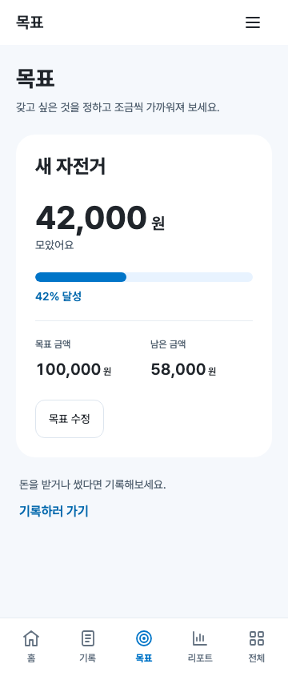

## 9. 목표 있음 — 390×844

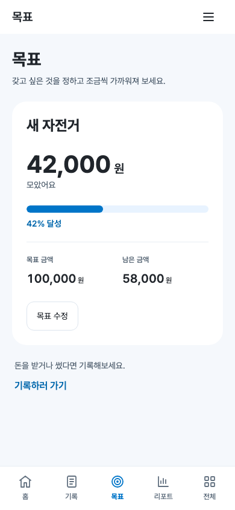

## 10. 목표 있음 — 430×844

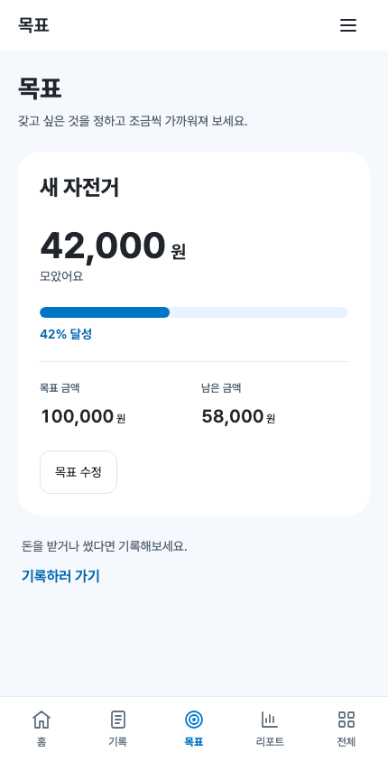

## 11. 목표 없음

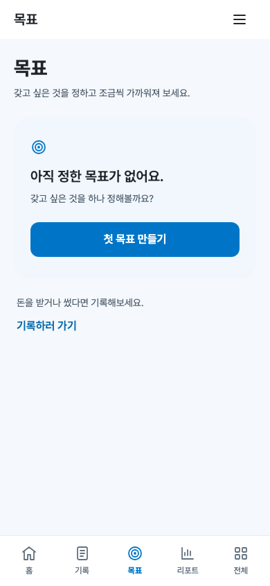

## 12. 목표 만들기 Sheet

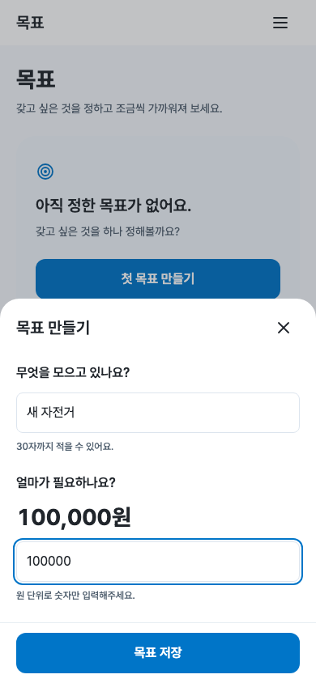

## 13. 목표 수정 Sheet

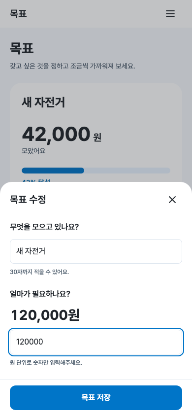

## 14. target validation 오류

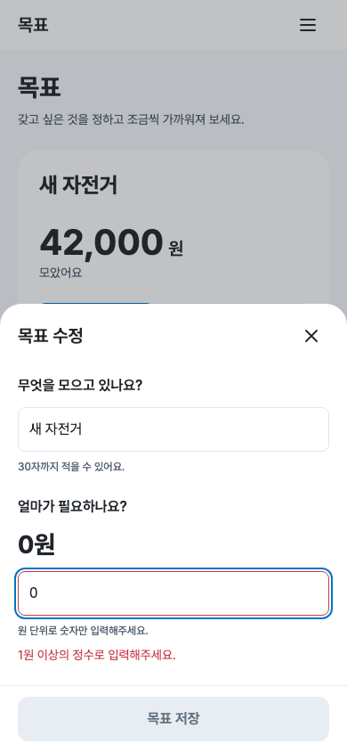

## 15. current보다 작은 target 오류

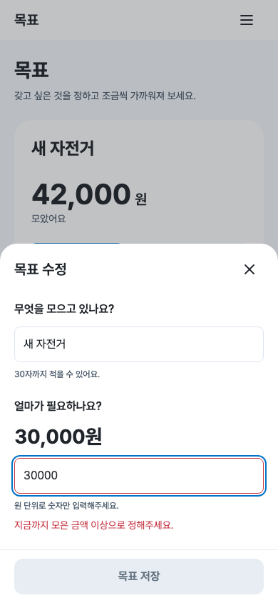

## 16. 목표 완료 상태

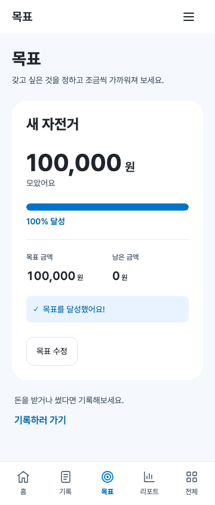

## 17. 긴 목표 이름·큰 금액

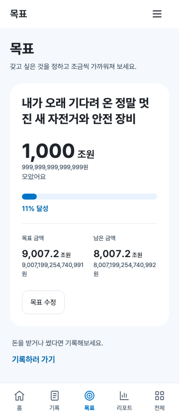

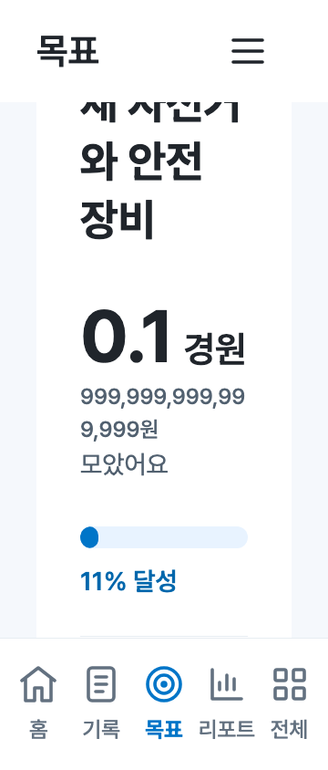

## 18. storage failure 상태

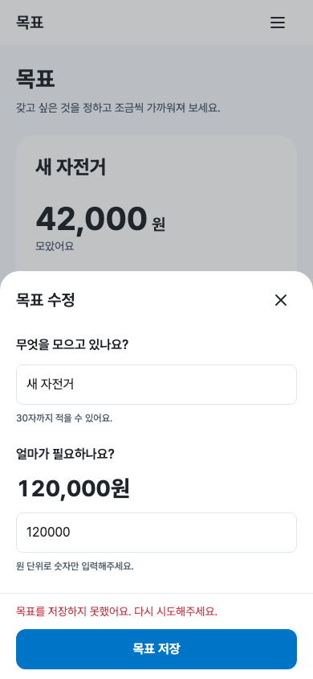

## 19. 저장 전/후 JSON diff

- [신규 생성 JSON](../evidence/PW-WOORI-04/storage-create.json) · [diff](../evidence/PW-WOORI-04/storage-create.diff)
- [target 수정 JSON](../evidence/PW-WOORI-04/storage-edit.json) · [diff](../evidence/PW-WOORI-04/storage-edit.diff)
- [이름만 수정 JSON](../evidence/PW-WOORI-04/storage-title.json) · [diff](../evidence/PW-WOORI-04/storage-title.diff)
- [기존 goal 없음 JSON](../evidence/PW-WOORI-04/storage-no-goal.json) · [diff](../evidence/PW-WOORI-04/storage-no-goal.diff)

42,000/100,000→target 120,000 저장 후 current는 42,000입니다. title만 수정해도 current/target이 유지됩니다. 기존 daysLeft·추가 속성과 비대상 데이터는 불변성을 검사했습니다. diff는 가독성을 위한 JSON 표현이며 실패 경로는 저장 문자열 자체의 동일성을 검사합니다.

## 20. 저장 후 Home 목표 카드

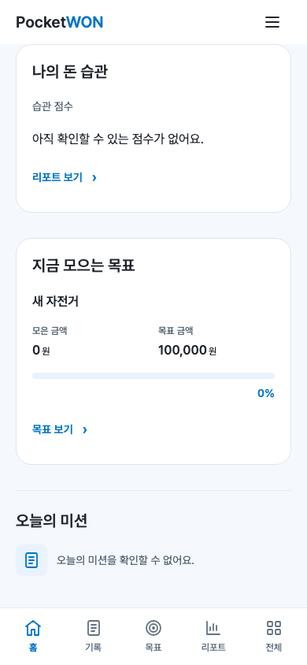

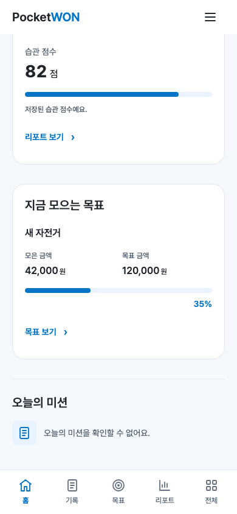

Home 재진입의 기존 재조회 구조를 사용합니다. 새 이름·목표금액·progress를 DOM으로 확인했습니다. 완료 목표의 Home 표현은 기존 완료 안내를 유지합니다. [시각 회귀 측정](../evidence/PW-WOORI-04/visual-regression.json)에서 Home·Record와 report/all의 이전 캡처를 비교했습니다. 11/12개 캡처는 바이트 동일합니다. home/390x844-home은 13픽셀에서 채널값 최대 2 차이가 있습니다. 바이트 동일 여부와 픽셀 차이를 구분해 기록했습니다.

## 21. reload persistence

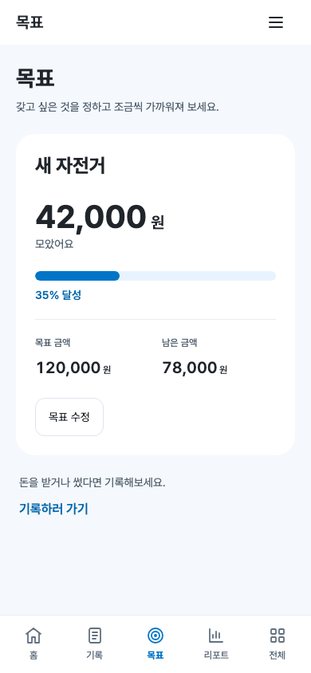

생성·target 수정·이름 수정·기존 goal 없음 모두 reload 후 storage 문자열과 목표가 유지됩니다. 기존 Shell처럼 reload는 Home으로 시작하며 목표 탭 재진입으로 확인합니다. reload 이후 쓰기는 0회입니다.

## 22. Record 회귀

[Record 64개 검증 결과](../evidence/PW-WOORI-04/record/verification.json). 받은 돈·쓴 돈·잔액 부족·실패 후 재시도·persistence·중복 저장 방지·keyboard/accessibility가 통과했습니다.

Goal 저장 후 실제 Record UI로 받은 돈 10,000원을 저장하는 추가 검사도 통과했습니다. balance만 기록 계약대로 증가하고 goal 전체와 monthly.goal은 유지됩니다. 빈 저장소에서 목표를 먼저 만든 뒤에도 첫 기록이 정상 저장됩니다.

## 23. keyboard / accessibility / 반응형

[Chromium 접근성 트리](../evidence/PW-WOORI-04/accessibility-Chromium.txt) · [WebKit 접근성 트리](../evidence/PW-WOORI-04/accessibility-WebKit.txt)

- h1/h2와 이름 있는 progressbar, min/max/now/valuetext, 완료 상태 텍스트를 제공합니다.
- Sheet는 이름 있는 native modal dialog입니다. 첫 이름 입력 focus, label, aria-describedby/invalid, 오류 alert, 성공 status를 제공합니다.
- Tab/Shift+Tab은 저장 버튼 활성/비활성 모두 dialog 안에서 순환합니다. Escape·닫기·성공 후 trigger로 복귀하고 focus-visible과 48px 이상 터치 영역을 유지합니다.
- 360/390/430×844, 360×640와 각 200% root font에서 화면·Sheet, 큰 금액·긴 이름·오류·완료 상태의 가로 overflow와 nav 간섭을 검사했습니다.
- 47/34/24px safe area 주입과 360×440 키보드 높이 모사를 검사했습니다. Sheet 내부 스크롤과 화면 안 저장 버튼을 확인했습니다. 하단 safe area는 footer에서 한 번만 적용합니다.
- 큰 금액은 숫자와 단위를 분리하고 필요하면 축약·줄바꿈합니다. 정확한 금액을 보조 텍스트·접근성 이름으로 유지하며 사용자 글자 크기를 줄이지 않습니다.
- 측정한 기본 화면·Sheet 텍스트 대비 최솟값은 4.796:1입니다.

실물 iPhone/Android 키보드, 스크린리더 실기기, axe 검사는 수행하지 않았습니다. 브라우저 접근성 트리·DOM·키보드 검사와 viewport 모사 범위입니다. 어린이 대상 3초 이해도 실험은 수행하지 않았으며 시각 위계를 자체 검수했습니다.

## 24. console / page error

최종 4개 검사 전체 0건입니다. 초기 200% 금액 overflow를 보완했고, 테스트 context 종료 전 웹폰트 로딩을 기다리도록 해 정상 로딩을 확인한 뒤 종료합니다. 오류를 필터로 숨기지 않습니다.

## 25. failed resource

최종 requestfailed 및 HTTP 4xx/5xx 0건입니다. 기존 Pretendard CDN만 사용하며 앱에 신규 런타임 의존성·API·SDK를 추가하지 않았습니다. 검사는 로컬 서버와 격리된 브라우저 context에서 수행했습니다.

## 26. 전체 source diff

[전체 source diff](../evidence/PW-WOORI-04/source.patch) · [파일 해시 명세](../evidence/PW-WOORI-04/delivery.json)

소스·검사·제출 생성기·README·보고서를 포함합니다. 생성 이미지·JSON과 보존 파일은 source diff 대신 해시 명세로 구분합니다.

## 시각 품질 자체 점검

| 검수 항목 | 판정 |
|---|---|
| 장식이 목표 이름보다 강하지 않음 | YES |
| 현재 모은 금액이 쉽게 읽힘 | YES |
| 하나의 progress와 퍼센트로 진행률을 바로 파악 | YES |
| Hero 하나와 간단한 정보로 카드 수 절제 | YES |
| primary blue 사용 절제 | YES |
| 쉬운 문구와 작은 아이콘, 유치한 장식 없음 | YES |
| 이름/금액 두 항목의 짧은 form | YES |
| 기존 current 임의 변경 없음 | YES |
| 새로운 적립/이체 규칙 없음 | YES |
| Home/Record와 같은 토큰·Sheet 패턴 | YES |

## 재현과 완료 경계

```sh
python3 -m http.server 4173 --bind 127.0.0.1
node tests/verify-goal.cjs
node tests/verify-record.cjs
node tests/verify-home.cjs
node tests/verify-shell.cjs
python3 tests/build-goal-delivery.py
```

검사는 기존 설치된 Playwright/Chromium/WebKit을 사용합니다. `PW_BASE_URL`은 localhost/127.0.0.1만 허용합니다. 실행 경로는 기존 PW_PLAYWRIGHT_MODULE/PW_CHROMIUM_EXECUTABLE/PW_WEBKIT_EXECUTABLE 환경변수로 재지정할 수 있습니다. 제출 생성기의 PNG 비교에는 기존 Pillow를 사용하며 앱 런타임 의존성이 아닙니다.

**PW-WOORI-04 완료 후 작업을 멈추고 검수를 기다립니다. 리포트·전체는 placeholder이며 목표 삭제·다중 목표·적립·부모 기능·배포는 구현하지 않았습니다.**
