# PW-WOORI-05 — 습관 리포트

## 1. 최종 검증 총합

**Report 110 + Goal 65 + Record 64 + Home 44 + Shell 46 = 329개 검증 묶음 PASS**. 기존 219개를 모두 재실행했습니다. Chromium 151.0.7922.34 / WebKit 26.5.

[검수 갤러리](../evidence/PW-WOORI-05/index.html) · [Report 검증 원문](../evidence/PW-WOORI-05/verification.json)

모든 데이터와 캡처는 격리된 임시 브라우저 context의 fixture입니다. 사용자 브라우저 프로필과 실제 저장소는 사용하지 않았습니다.

## 2. 변경 파일 목록

[변경 11개 파일](../evidence/PW-WOORI-05/changed-files.md). 구현 전 327개 파일의 해시와 수정 대상 6개 원문을 보존했습니다. 비대상 321개는 byte-identical입니다. Git 저장소가 없어 보존본 기반 unified diff를 제출합니다. 앱 공통 변경은 Report 로딩과 lifecycle 분기 연결에 한정합니다.

## 3. 구현 전 원본 Report/AI Score 데이터 분석

**현재 실행 구조**

실행 진입점은 `ks6s3juocjzc2.kimi.page/index.html`이다. app.js의 showScreen은 기존 view.dispose → 탭별 create → replaceChildren → mount 순서로 작동한다. Home/Record/Goal 진입 때마다 loadPocketWONState()를 호출한다. Report/All은 else 분기 placeholder였다. Report 전용 분기를 추가해 같은 재조회 구조를 사용하고 navigate callback은 showScreen(target, true)로 h1 focus를 유지한다. Record와 Goal은 sheet 열기 및 저장 직전에 재조회하며 저장은 명시적 제출에만 수행한다. Report에는 제출 동작이 없다.

**원본 데이터 근거**

원본: `preservation/PW-WOORI-01/original-index.html.txt` (비실행 참조).

| 원본 줄 | 함수/필드 | 실제 의미와 채택 경계 |
|---|---|---|
|1512–1565|defaultState|habitScore 82, monthly.saving 15200/spending 12300/goal 45000, goal title/target/current/daysLeft, transactions 4건, streak 7, points 1250, missions boolean 배열, recordedDays 일 숫자 배열. fixture 전용 값이며 앱 기본값으로 주입하지 않는다.|
|1570–1588|loadState/saveState/resetState|원본은 잘못된 상태에 default를 넣고 저장/reset한다. 현재 loadPocketWONState의 loaded/empty/invalid/unavailable 계약만 사용한다.|
|1981–1991|기록 저장|in은 balance와 monthly.saving 증가, out은 balance 감소/monthly.spending 증가. recordedDays와 streak를 갱신하던 원본 동작은 재사용하지 않는다. saving은 받은 돈 누계이며 월 식별자는 없다.|
|2054–2057|bindGoal 미션 처리|missions 변경, current에 1000 가산, points에 10 가산. 승인된 PW04와 충돌하므로 미사용.|
|2088–2112|goalSave|title/target/current/daysLeft, monthly.goal을 저장하던 원본. Report는 현재 createGoalViewModel만 사용하며 current 직접 편집/자동 적립은 없다.|
|2127–2143|categoryTotals/coachMessage|거래 외 CAT_BASE/CAT_HIDDEN 고정값과 0.55/6000 임계값에 의한 코칭. 실제 분석 근거로 채택하지 않는다.|
|2145–2240|renderScore/bindScore|habitScore 표시 외 plan 100/72/100/85, 분모 17000/12000 등 고정 비교값 및 heuristic 코칭. 도움말의 점수 계산 주장과 달리 habitScore 생성·갱신 구현은 발견되지 않는다. 단일 저장 점수 표시만 채택한다.|
|2301–2371|renderCalendar/bindCalendar|2024년 5월 고정 기준월, calOffset, recordedDays, specialDays, today, streak, points 의존. 일 숫자만으로 현재 월/오늘 기록을 추정할 수 없다. 월 이동도 saveState 호출하므로 재사용하지 않는다.|
|2386–2448|renderParentReport/bindParentReport|scores=[65,72,82,90]와 weeks가 하드코딩. user.name·habitScore·streak 공유, navigator.share/clipboard 호출. 조사 근거로만 보며 공유·추이·칭찬·보상 UI는 구현하지 않는다.|

현재 state.js: pwMoney는 0 이상 safe integer, validPocketWONTransaction은 object/type in 또는 out/양의 safe integer amount/비어 있지 않은 category를 검사한다. ts의 날짜 신뢰성은 parsePocketWONDate로 별도 판정한다. 사용자 확정에 따라 Report 건수는 기존 거래 검증 함수를 사용하며 날짜 불명확 거래도 포함한다. receipt/memo의 새 검증 규칙을 만들지 않는다. createGoalViewModel은 null/missing goal을 empty, 잘못된 이름/금액을 invalid로 분리하고 current>=target으로 완료를 판단한다. percent는 기존 Math.round와 0~100 clamp를 유지한다.


## 4. habitScore 계약

실제 finite number이며 0~100인 값만 그대로 표시합니다. 0/100/소수, missing/null/문자열/-1/101/NaN/Infinity를 검사했습니다. 소수 Score를 임의 반올림하지 않습니다. 확인 불가 상태는 점수 대신 “확인 안 됨”으로 전달합니다. 점수 계산·증감·세부 점수·코칭·AI 호출은 없습니다.

## 5. monthly 계약

saving=받은 돈 누계, spending=쓴 돈 누계. 각각 0 이상 safe integer인 경우만 표시합니다. 두 값이 모두 유효할 때만 차이=saving-spending이며 음수도 보존합니다. balance와 별개이고 “저장된 집계 · 기간 확인 안 됨”을 표시합니다. 부분 누락을 0으로 채우지 않습니다.

## 6. transaction / goal 읽기 규칙

validPocketWONTransaction을 통과한 전체 배열 건수를 집계합니다. 사용자 결정에 따라 날짜 불명확 거래도 포함하며 새 receipt/memo 검증 규칙은 없습니다. invalid 혼합은 유효 건수와 “확인 가능한 기록만 포함했어요”를 표시합니다. 빈 배열 0건과 배열 누락 확인 불가를 구분합니다. 정렬·재저장은 없습니다.

Goal은 createGoalViewModel을 그대로 사용해 이름 trim, safe integer current/target, target>0, remaining=max(target-current,0), 기존 round/clamp percent를 유지합니다. 완료는 current>=target 판정이며 반올림으로 100%여도 current<target이면 완료라 하지 않습니다. 날짜·적립 규칙을 추가하지 않습니다.

## 7. Report ViewModel 구조

createReportViewModel(state)는 score {status,value}, moneyFlow {status,received,spent,difference,period}, goal {status,...기존 Goal 결과}, records {status,count,partial}를 반환합니다. 상태 객체를 바꾸지 않는 pure function이며 deeply frozen fixture로 검증했습니다.

createReportView(loaded,navigate)는 element/mount/dispose를 반환합니다. mount는 금액 크기 측정, dispose는 ResizeObserver와 예약 프레임을 해제합니다. document.fonts.ready 이후에도 disposed guard를 적용합니다. 사용자 문자열은 textContent로 렌더링합니다.

## 8. localStorage read/write 결과

Report의 setItem/removeItem/clear는 각각 **0회**, 다른 키 접근도 **0회**입니다. 진입·scroll·focus·Report→Home/Record/Goal/All·reload 전후 raw string을 비교했습니다. 90개 storage 확인 기록이 verification.json에 있습니다. FLOW의 Record 2회와 Goal 2회는 명시적 저장으로 별도 계측하며 Report 읽기 구간 쓰기는 0회입니다. fixture 주입/외부 변경 모사는 앱 계측 밖의 native storage 함수로 수행합니다.

## 9. 360×844

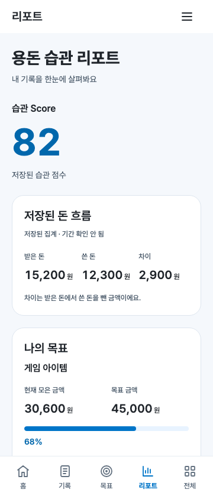

가로 overflow, 숫자 잘림, content/nav 겹침 없이 검사했습니다.

## 10. 390×844


## 11. 430×844

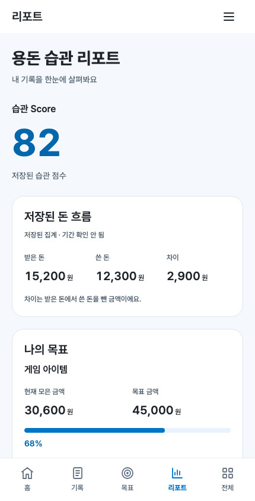

## 12. empty

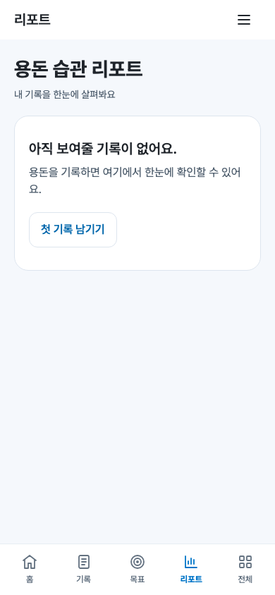

“아직 보여줄 기록이 없어요.”와 첫 기록 CTA를 제공합니다. 진입만으로 저장 키를 생성하지 않습니다.

## 13. invalid / unavailable

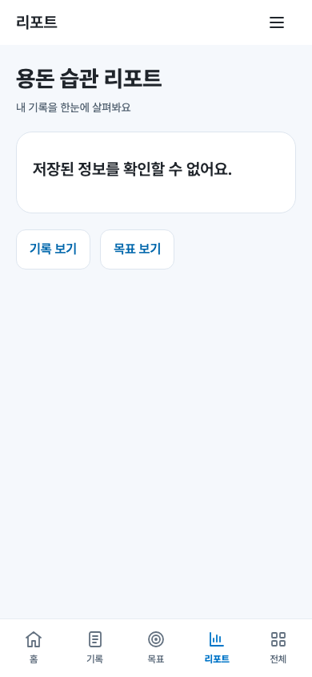

malformed JSON과 invalid root는 “저장된 정보를 확인할 수 없어요.”, getter/read 예외는 “저장된 정보를 불러오지 못했어요.”로 구분합니다. 자동 reset/migration/overwrite는 없습니다.

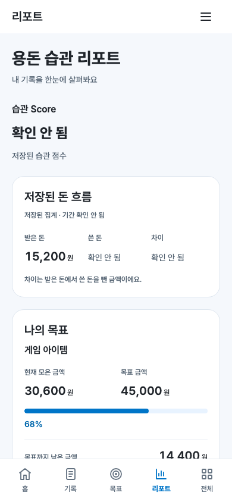

부분 상태는 각 영역의 사용 가능한 값만 표시합니다.

## 14. score 0 / 100 / missing

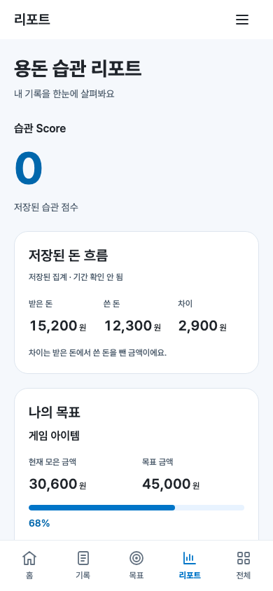

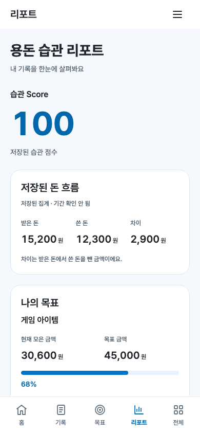


## 15. active / complete goal


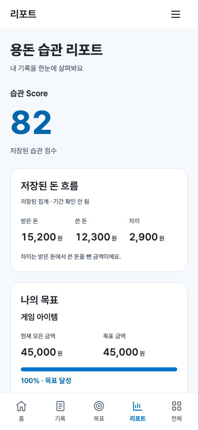

진행률 min/max/now/valuetext와 “목표 달성” 텍스트를 검증했습니다. 초과 달성도 실제 current는 보존합니다.

## 16. 큰 금액 / 긴 문자열

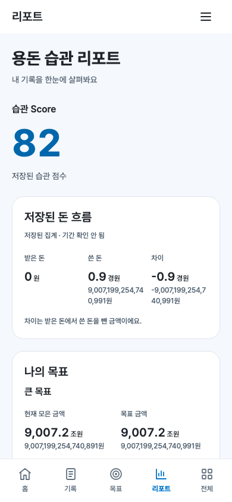

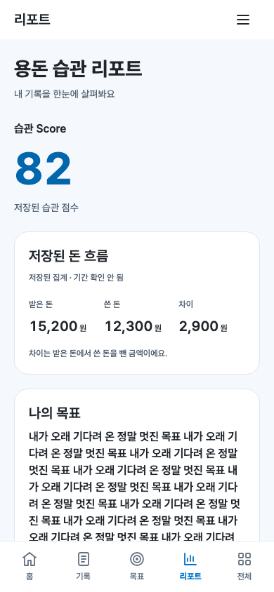

±Number.MAX_SAFE_INTEGER, 큰 goal 금액, 매우 긴 한국어/HTML 모양 이름을 검사했습니다. 금액은 필요시 만·억·조·경으로 시각적 축약하며 정확한 금액을 보조 텍스트와 accessible name으로 제공합니다. 사용자 글자 크기를 줄이지 않습니다.

## 17. Record → Report 최신 반영

FLOW B/C: 실제 Record UI로 받은 돈 1000원과 쓴 돈 1000원을 각각 저장한 후 Report를 재진입했습니다. 각각 받은 돈/쓴 돈과 기록 수가 최신이며 habitScore/goal은 불변입니다. 원본 거래 순서도 보존합니다.

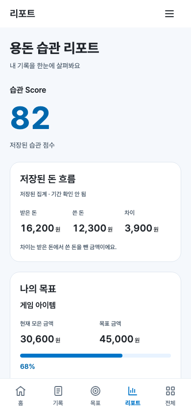


## 18. Goal → Report 최신 반영

FLOW D/E: 실제 Goal UI에서 이름만 수정한 경우와 target을 60000원으로 수정한 경우를 검사했습니다. Report에 최신 title/target/remaining/percent가 반영되고 current=30600과 habitScore, transactions는 유지됩니다. FLOW F/G에서는 화면 밖 fixture 변경 후 재진입으로 저장소 재조회를 확인했습니다.

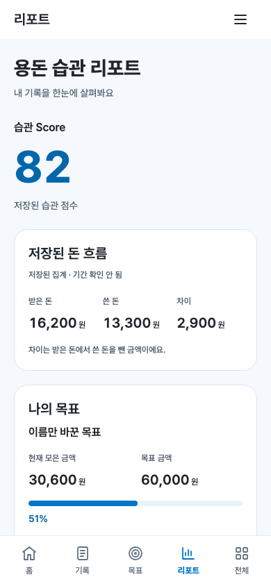

## 19. reload persistence

FLOW H: reload는 Home에서 시작합니다. 그 자체 write는 0이며 Report 재진입의 값과 storage raw string이 동일합니다. 양 브라우저별 storage-flows JSON에 fixture 전후 상태와 명시적 저장 횟수를 제공합니다.

## 20. accessibility / keyboard / 200%

[Chromium 접근성 트리](../evidence/PW-WOORI-05/accessibility-Chromium.txt) · [WebKit 접근성 트리](../evidence/PW-WOORI-05/accessibility-WebKit.txt)

h1 하나, 각 section h2, 점수 텍스트, progressbar name/min/max/now/valuetext, 48px 이상 버튼, Tab/Shift+Tab, Enter/Space 및 목적지 h1 focus를 검사했습니다. 최소 측정 텍스트 대비는 5.576:1입니다. 360×640와 360/390/430 글자 크기 200%, 상하 safe area 24/34/47px 조합을 검사했습니다.


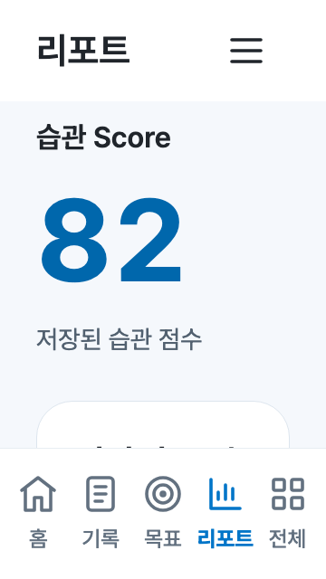

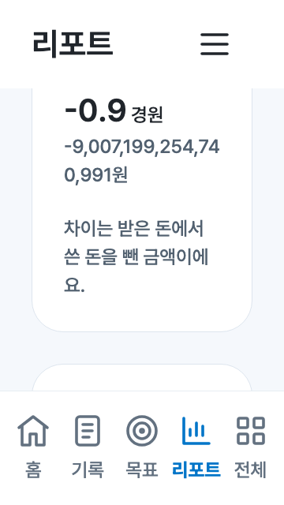

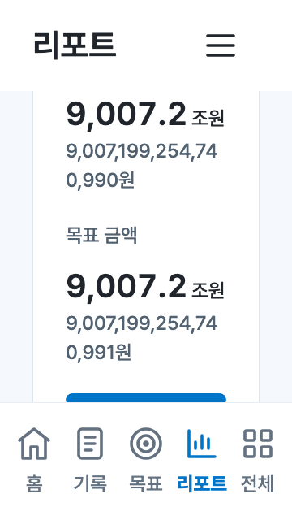

200%에서는 세로 스크롤로 전체 정보를 읽습니다. 실기기 스크린리더/어린이 이해도 실험은 수행하지 않았습니다.

## 21. visual regression

[픽셀 비교 원문](../evidence/PW-WOORI-05/visual-regression.json). PW04의 Home/Record/Goal/All 각 360/390/430 캡처 **12/12 byte-identical**, changedPixels=0, maxChannelDifference=0, 영향 영역 없음입니다. threshold를 늘리지 않았고 비대상 제품 CSS를 수정하지 않았습니다.

## 22. console / page error

최종 다섯 검사 전체 console.error=0, pageerror=0. Report 결과는 두 이벤트를 별도 배열로 제공합니다. 기존 검증은 기존 consoleErrors 수집 방식으로 둘 모두 0임을 확인합니다. 초기 placeholder 기대값 실패와 trim 기대값 불일치를 수정한 후 최종 전체 결과를 제출합니다.

## 23. failed resource

최종 requestfailed=0, HTTP 4xx/5xx=0. Report는 별도 배열, 기존 검증은 기존 resourceErrors/networkErrors 배열로 제공합니다. 오류 필터는 없습니다. 기존 Pretendard CDN 외 새 runtime network dependency는 없습니다. 초기 Shell assertion 실패 때 font 요청 중단 1건, 초기 Goal 검사에서 font 요청 중단이 발견되어 두 번의 실패 결과를 보존했습니다. Goal의 검사 종료/reload 전에 layout과 fonts.ready 대기를 보강했습니다. 오류는 필터링하지 않았으며 최종 재실행에서 0건입니다. 초기 Goal 실패 원문은 attempts/goal-first-run.json과 goal-second-run.json으로 보존합니다. 두 번째 진단은 invalid state 검사 중 Home 진입 직후 reload하는 경로를 특정했고 해당 reload 전 font 대기를 추가했습니다.

## 24. 전체 source diff

[source.patch](../evidence/PW-WOORI-05/source.patch) · [delivery.json](../evidence/PW-WOORI-05/delivery.json). 기존 수정 파일의 보존본과 신규 소스/테스트/보고서 전체를 포함합니다. 임시 디렉터리에 patch를 적용한 후 모든 결과 파일의 byte equality를 검증합니다. 생성 캡처·JSON·보존 파일은 별도 SHA-256 manifest에 포함합니다.

## 25. 시각 품질 자체 점검

| 항목 | 판정 |
|---|---|
| Score가 화면의 첫 시각 초점인가 | YES |
| Score보다 장식이 강하지 않은가 | YES |
| 근거 없는 세부 점수를 만들지 않았는가 | YES |
| 돈 흐름의 기간을 거짓으로 특정하지 않았는가 | YES |
| saving을 저축액으로 잘못 표현하지 않았는가 | YES |
| 목표 상태가 3초 내 이해되는가 | YES |
| 카드 수가 과하지 않은가 | YES |
| primary blue 사용이 절제되어 있는가 | YES |
| gradient가 없는가 | YES |
| shadow가 없는가 | YES |
| character가 없는가 | YES |
| 어린이에게 쉬운 표현인가 | YES |
| 성인 자산관리 UI처럼 보이지 않는가 | YES |
| 200%에서도 정보 위계가 유지되는가 | YES |
| Home / Record / Goal과 같은 제품처럼 보이는가 | YES |

실제 캡처 검수에 따른 자체 판정입니다. “3초”는 사용자 실험 결과가 아니라 시각 위계 검수 기준입니다. 200% 검수에는 스크롤한 Score/돈 흐름/목표/하단 캡처도 포함합니다.

## 26. 재현 명령

```sh
python3 -m http.server 4173 --bind 127.0.0.1
node tests/verify-report.cjs
node tests/verify-goal.cjs
node tests/verify-record.cjs
node tests/verify-home.cjs
node tests/verify-shell.cjs
python3 tests/build-report-delivery.py
```

기존 설치 Playwright와 Chromium/WebKit, Python Pillow를 사용합니다. PW_BASE_URL은 localhost/127.0.0.1만 허용하며 PW_PLAYWRIGHT_MODULE/PW_CHROMIUM_EXECUTABLE/PW_WEBKIT_EXECUTABLE로 기존 설치 경로를 지정할 수 있습니다. 라이브 앱/외부 배포는 하지 않습니다.

## 27. 완료 경계

**PW-WOORI-05 완료.** report만 실제 화면으로 교체했습니다. All은 placeholder이고 부모 공유·AI 계산·캘린더·보상·API·DB·서버·배포는 구현하지 않았습니다. 다음 슬라이스로 진행하지 않고 사용자 검수를 기다립니다.
